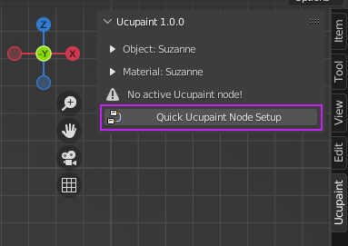
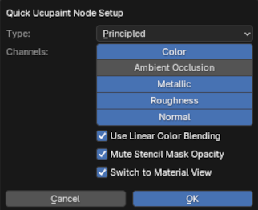
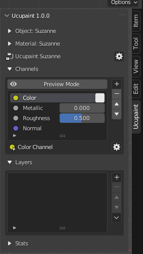
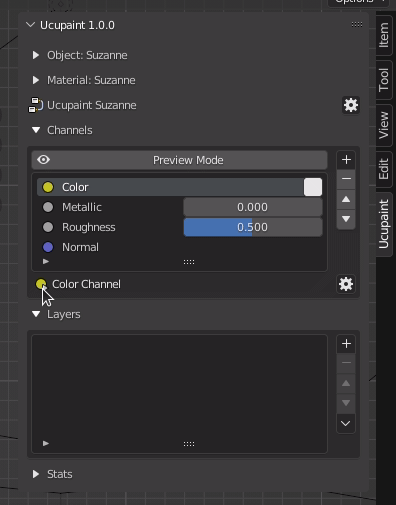

# Quick setup

Assuming you've already installed the addons. The Ucupaint menu will appear on Ucupaint tab on n-panel if you select an object.
Before continue, read this list first:

- **Make sure you're on material view**
- **Make sure your object already properly unwrapped** to avoid normal glitch that can happen if you're using normal channel.
- Even though this addon support more than mesh objects, **some features will not available if you choose to use non-mesh objects** (like all baking related operation).

For a quick setup of the Ucupaint node, you can click the "Quick Ucupaint Node Setup" button.

||
|:--:|
|Quick setup button| {align=center}

A popup menu will be shown and give you some options for setting up the node. There's an option to use different shader type and channels, for now let's just use the default value.
  
||
|:--:|
|Quick setup options| {align=center}

The "OK" button will finish the setup process, now Ucupaint is ready to use. You can see the chosen channels and layers list which is still empty for now

||
|:--:|
|Ucupaint is now ready to use!| {align=center}

If you open the shader editor, what's actually happening is the quick setup is created a group node that connect to the default shader (Principled Shader) according to the selected channels you choose before. Please don't edit the inside of this group node manually since it can cause fatal error.

||
|:--:|
|What quick setup actually creates| {align=center}

## Collapse/Uncollapse Menu

Please notice that if you see a small triangle beside an icon, it means you can collapse or uncollapse the extra menu, you can see on example gif below.

||
|:--:|
|A triangle beside an icon means you can collapse and uncollapse more menu| {align=center}

