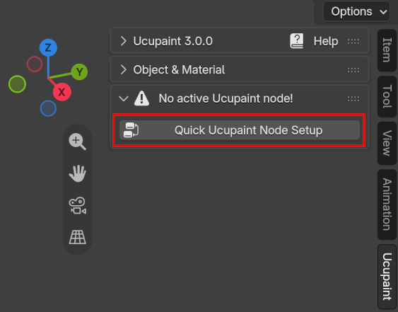
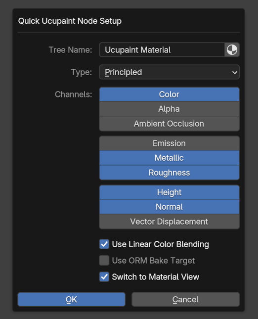
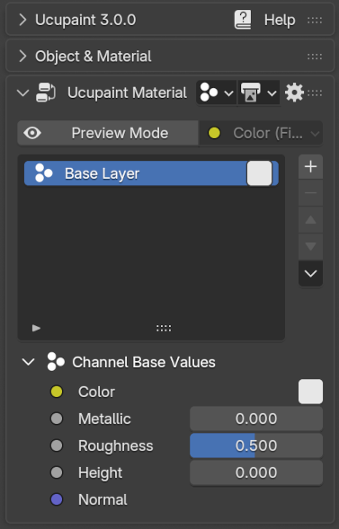
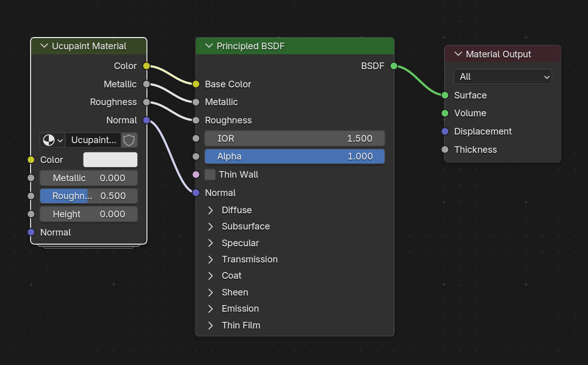
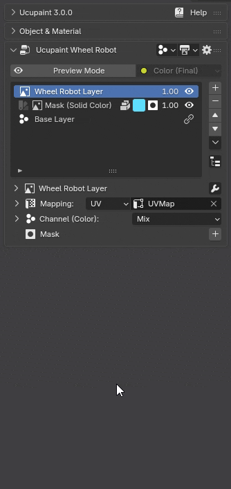

# Ucupaint 设置

## 准备设置 Ucupaint

以下步骤假设你已经安装好插件。选中对象后，3D 视图的侧栏（按 `N` 切换）中会出现 Ucupaint 标签页。
继续之前，请确认：

- **当前处于材质预览模式**
- **对象已经正确展开 UV**
- 虽然 Ucupaint 不只支持网格对象，**但烘焙等部分功能只能用于网格对象**。

## 创建 Ucupaint 节点

**Ucupaint 是一个节点组。** 你可以直接在着色器编辑器中创建新的 Ucupaint 节点。

||
|:--:|
|在着色器编辑器中创建新的 Ucupaint 节点| {align=center}

在着色器编辑器中按 `Shift + A`，依次选择 **Group → Ucupaint**，即可把节点添加到材质中。新建的 Ucupaint 节点默认只有一个 **Color** 通道。
你可以根据需要，把 **Color** 输出连接到着色器中的其他节点。通道的详细说明请参阅[通道页面](../01.01.channel/)。

## 快速设置

你也可以在 3D 视图中点击 **Quick Ucupaint Node Setup** 按钮，快速设置 Ucupaint 节点。

||
|:--:|
|快速设置按钮| {align=center}

随后会出现一个弹出菜单，其中提供了多个节点设置选项。你可以选择不同的着色器类型，并添加需要的通道。

||
|:--:|
|快速设置选项| {align=center}

快速设置菜单包含以下选项：

- **Tree Name**：Ucupaint 节点组（节点树）的名称。启用右侧图标后，会使用材质名称作为 Ucupaint 节点树名称。
- **Type**：Ucupaint 节点将连接到的 BSDF 着色器类型。
- **Channels**：节点中默认包含的通道组合（之后仍可继续添加通道）。
- **Use Linear Color Blending**：启用图层之间的线性色彩混合。*这种方式在颜色计算上更准确，但表现会不同于 Photoshop 等传统 2D 软件。*
- **Mute Stencil mask Opacity**：禁用默认的纹理绘制覆盖显示，以便在材质视图中看到其他图层。
- **Switch to Material View**：设置完成后，自动把视图着色切换到材质视图。

点击 **OK** 即可完成设置。现在 Ucupaint 已经可以使用，你会看到通道和图层列表。

||
|:--:|
|Ucupaint 已经可以使用| {align=center}

打开着色器编辑器后，可以看到快速设置根据之前选择的通道创建了一个节点组，并把它连接到默认的原理化 BSDF 着色器。**请不要手动编辑这个节点组内部的内容，否则可能导致严重错误。**

||
|:--:|
|快速设置实际创建的节点连接| {align=center}

## 连接 Ucupaint 节点树

如果着色器编辑器中已经存在节点树，Ucupaint 节点会被插入到现有节点与着色器之间。已有通道会自动通过 Ucupaint 节点重新连接，**原有设置会被保留，并继续按之前的方式工作。**

下面的视频演示了这一过程。

||
|:--:|
|把 Ucupaint 节点树连接到已有节点设置| {align=center}

## 展开和折叠菜单

Ucupaint 的界面初看比较简洁，但**可折叠菜单**中还包含更多选项。看到某个区域旁的小三角或箭头时，表示这里还有可以展开的设置。下面的 GIF 展示了这种交互。

||
|:--:|
|展开和折叠附加选项| {align=center}
