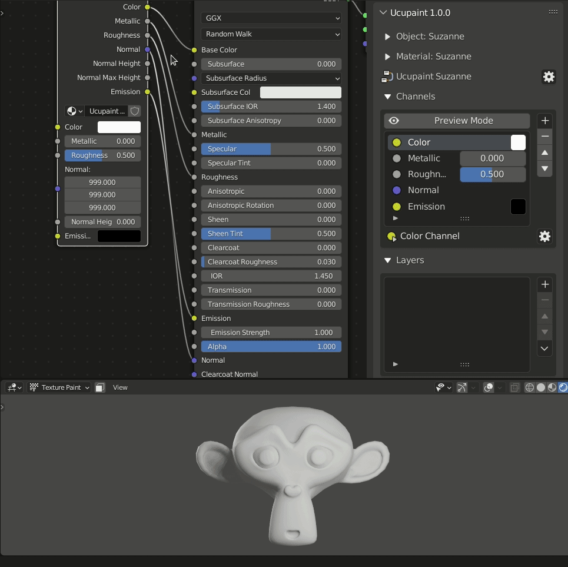
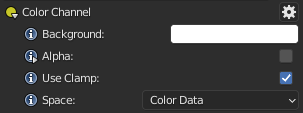
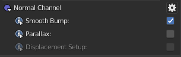
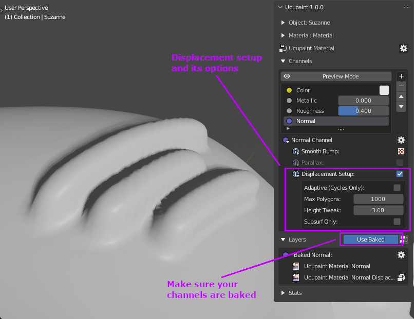

## Channel

A channel in Ucupaint represents the input and output of an Ucupaint node. 

||
|:--:|
|Ucupaint channels represents the IO on the actual node| {align=center}

Each channel has at least one input and one output, but channels like the normal channel can have multiple outputs at the end. The base color/value of the channel is actually the default input of the node, as demonstarated on the gif below.

||
|:--:|
|Base color/value of a channel corresponds to the default input of the node| {align=center}

*If you notice that normal have default value of (999, 999, 999), just ignore that, it's basically a litlle hack to make the normal channel works properly.* 

All the inputs and outputs can be connected anywhere, so you can connect the Ucupaint node to your custom node setups.
 
 
On channel list panel, you can do some basic operations to the channel list items, like add, move and remove.

||
|:--:|
|Channels list panel| {align=center}

!!! note
    *You might need to learn to create a layer before continue on this page, click [here](../01.02.layer/#creating-new-layer-quick-guide) to jump to Layer page*

## Creating New Channel

To create new channel, you can use '+' button on the right of the channel list. The video below will show you how to create Emission channel.

<!-- TEMP OLD TEXT: You can create new channel by using the + button on the right of the chanels list, it will gives you channel type options, which are RGB, Value, and Normal.
For demonstration, let's try to create new channel that connect to emission socket on the principled bsdf.
Now the popup appears, if you already decided to connect it to principled bsdf, you don't have to manually name the channel, just choose emission on the dropdown, it will automatically set the name of your channel, and if you click ok, it will also connect the sockets. -->

||
|:--:|
|Creating new channel| {align=center, width=100%}

You can see that the Ucupaint node will have new input and output sockets after you created a new channel.

## Channel Types
There are three types of channels in Ucupaint, they are RGB, Value, and Normal.

### RGB
RGB channel consists of three values of red, green, or blue. You can also enable alpha to add an alpha value, this also makes the base color transparent by default.

||
|:--:|
|RGB channel options| {align=center}

If alpha is activated it will automatically change your material to use alpha blend on Eevee. The default value of alpha is 0.0 so your background will be transparent.
If you create a layer with a mix blend, it will sit on top of your transparent background, which can be useful in many cases, like creating hair planes or vegetation.

||
|:--:|
|Using alpha on color channel| {align=center}

### Value
Value channels consist of a single value.

||
|:--:|
|Value channel options| {align=center}

### Normal
Normal channels consist of a normal vector, you can only have one normal channel per each Ucupaint node.

||
|:--:|
|Normal channel options| {align=center}

#### Smoother Bump
Smooth bump can make your bump map smoother than the Blender default at the cost of precision.

||
|:--:|
|Smooth Bump comparison| {align=center}

#### Parallax (Experimental)
Parallax is for creating parallax effects if you're using bump map. I suggest you save your file first before activating this option since it can freeze Blender. Please note that parallax only works in perspective view. Parallax is only available if you enable experimental features in Ucupaint User Preferences.

||
|:--:|
|Parallax comparison| {align=center}

#### Displacement Setup
Enabling _Displacement Setup_ will do two things:

- Add subdivision surface modifiers to all objects that use the same material
- Add displacement node setup to active material

By doing this all bump maps used in layers will actually have bump geometry. Unless for layers which have 'Write Height' enabled in the layer channel settings.
<!-- Need more explanation -->

||
|:--:|
|Using Displacement| {align=center}

