# Channels

## Accessing Channel Settings

While layer can also have channel settings, global channel settings can be accessed in the channel button above layers list.

<!--
|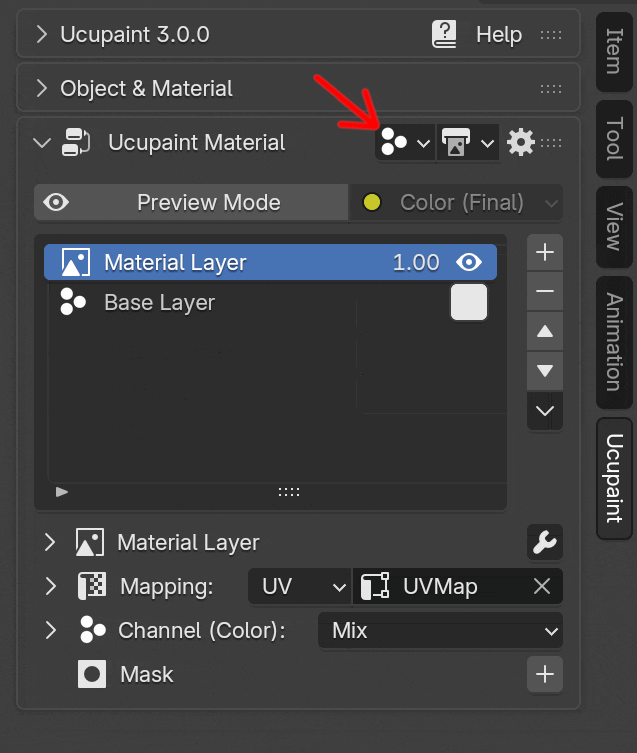|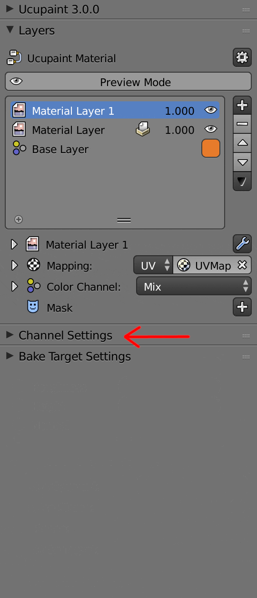|
|:--:|:--:|
|Clicking channels button above layers list will show channel settings list| Channel settings is below layers list in Blender 2.7x | {align=center}
-->

||
|:--:|
|Clicking channels button above layers list will show channel settings list|

Blender 2.7x have the channel settings below the layers list, but you can also use this UI in modern Blender versions (2.80+) if you enable `Use Non-Popup Channels and Bake Targets UI` in the preferences.

## Channel in Ucupaint

A channel in Ucupaint represents a pair consisting of an input and an output within the Ucupaint node. 

|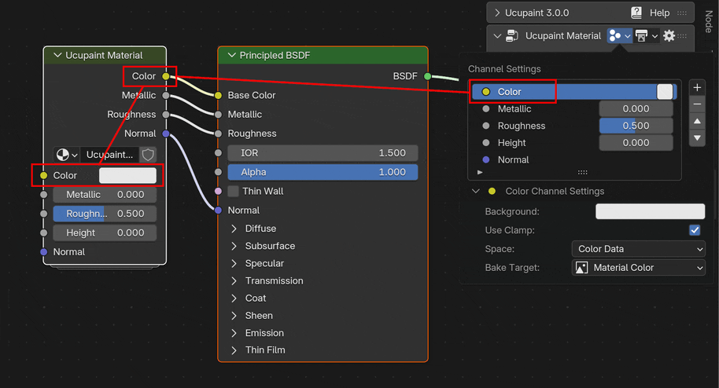|
|:--:|
|The Ucupaint channels input and output (I/O) on the actual node| {align=center}

Each channel has at least one input and one output, except for the `Height` channel, by default it doesn't have an output (read [Displacement Setup](#displacement-setup) for more info).

The base color or value of the channel is the default input of the node, as shown in the GIF below.

||
|:--:|
| (**TODO: Update needed**) The base color or value of a channel corresponds to the node’s default input| {align=center}

All inputs and outputs can be freely connected, allowing the Ucupaint node to work with your custom node setups.
 
 
In the channels list panel, you can perform basic actions such as adding, moving up/down, or removing channels.

|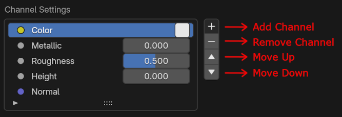|
|:--:|
|Channels list panel| {align=center}

!!! note
    You may need to learn how to create a layer before continuing on this page. Click [here](../01.02.layer/#creating-new-layer-quick-guide) to jump to the Layer page

## Adding a New Channel

To add a new channel, use the `+` button next to the channel list. The video below demonstrates how to create an Emission channel in Ucupaint.

<!-- TEMP OLD TEXT: You can create new channel by using the + button on the right of the channels list, it will gives you channel type options, which are RGB, Value, and Normal.
For demonstration, let's try to create new channel that connect to emission socket on the principled bsdf.
Now the popup appears, if you already decided to connect it to principled bsdf, you don't have to manually name the channel, just choose emission on the dropdown, it will automatically set the name of your channel, and if you click ok, it will also connect the sockets. -->

||
|:--:|
|(**TODO: Update needed**) Adding a new channel| {align=center, width=100%}

After creating a new channel, the Ucupaint node will display new input and output sockets corresponding to that channel.

## Main Channel Types
There are three channel main types in Ucupaint: `RGB`, `Value`, and `Vector`. Color is an example of a `RGB` channel, Metallic, Roughness, and Height are examples of `Value` channels, and Normal is a `Vector` channel.

### Channel Settings
The channel settings for the selected channel can be accessed under the channel list.

<!--
|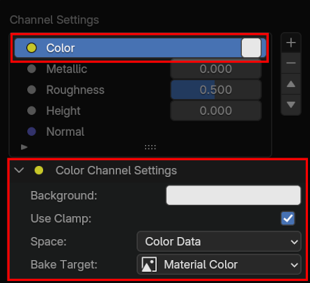|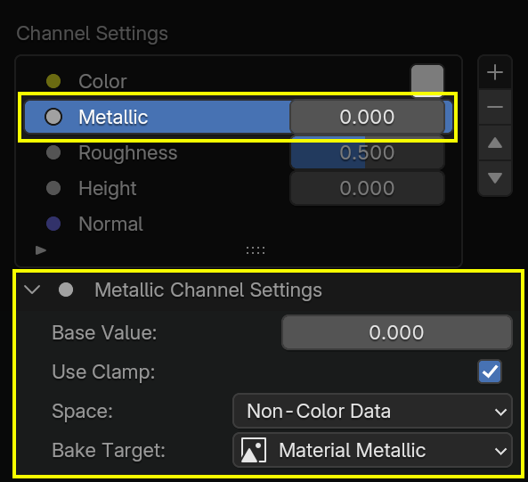|
|:--:|:--:|
|Example of RGB channel settings | Example of value channel settings |{align=center}
-->

||
|:--:|
|Example of RGB channel settings | {align=center}

Here are the options available in the channel settings:

- **Background/Base Value**: The node input value of the channel, it is also accessible in the `Base Layer` and beside the channel name in the channel list.
- **Use Clamp**: Limit the value output of the channel to 0.0-1.0 range.
- **Space**: Color space of the channel, use `Color Data` for channel that will used for color, and `Non-Color Data` for channel that will be used for non-color purpose.
- **Bake Target**: The bake target that will be used as the data when baking the Ucupaint node.
- **Special Type**: This option will show up in certain channel, this is to set the channel as special channel explained in [Special Channel Types](#special-channel-types) section

<!--

#### Alpha channel in Ucupaint 2.3x or lower 

If alpha is enabled, your material will automatically switch to Alpha Dithered method in Eevee. The default alpha value is 0.0, making the background fully transparent.
If you create a layer with a mix blend, it will be placed on top of the transparent background. This can be useful for cases like creating hair planes or vegetation.

||
|:--:|
|Using alpha on color channel| {align=center}

-->

## Special Channel Types

There are special channel types in Ucupaint that do more than regular channels. In version 3.0 the special channel types are `Alpha`, `Height`, `Normal` and `Vector Displacement`.

### Alpha channel

<!-- Ucupaint 2.4.0 introduces new dedicated channel for alpha channel, and it pairs to the color channel by default. Demo of the dedicated alpha channel is available in [YouTube video](https://www.youtube.com/watch?v=EEHSA5tfbU0). -->

Alpha channel need to be paired with to color channel to work effectively.  Alpha channel also uses special blending that make sure the final color is rendered correctly.

<!--
|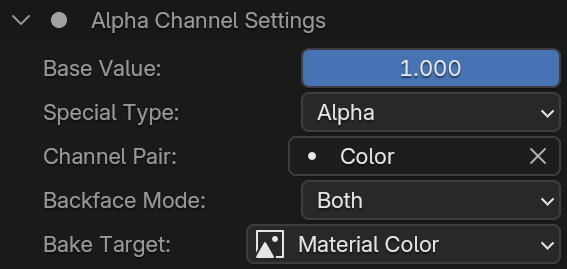|
|:--:|
|Alpha channel settings | {align=center}
-->

Specific settings which available in alpha channel are:

- **Channel Pair**: Links a color channel with the alpha channel. When the color channel is enabled on a layer, the alpha channel is automatically activated as well.
- **Backface Mode**: Option to hide the backface or frontface of the object.

### Normal channel

Normal channel is a special channel that outputs world space normal of the object surfaces.

<!--
|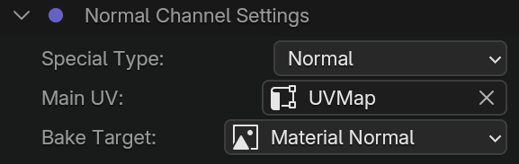|
|:--:|
|Normal channel settings | {align=center}
-->

Specific settings which available in alpha channel are:

- **Main UV**: UV Map that will be used for calculating tangent which needed for `Overlay` blending mode

### Height channel

<!-- Height channel by default will be used as bump if there's a normal channel and the option `Use Height as Bump` is enabled. -->
Height channel by default will be used as bump if there's a normal channel and the [Displacement Setup](#displacement-setup) isn't enabled yet.

<!--
|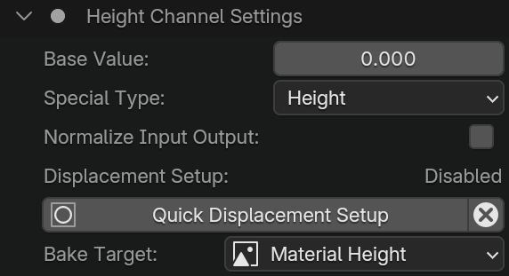|
|:--:|
|Height channel settings | {align=center}
-->

Specific settings which available in height channel are:

- **Normalize Input Output**: This will normalize the height channel output to fit in 0.0-1.0 range. It also also will create midlevel input that can control the midlevel of the height input.
- **Displacement Setup**: Displacement setup is just a status label. If you do the `Quick Displacement Setup`, this will enable the displacement setup, meaning the height output will be accesible and it's automatically connected to displacement node.

<!-- The button `Quick Displacement Setup` -->

### Vector Displacement channel

Vector displacement channel is similar to height channel but rather than just using up and down height, it can use vector to displace the object surface

<!--
|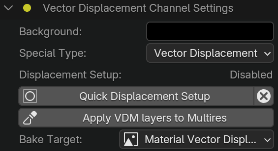|
|:--:|
|Vector Displacement channel settings | {align=center}
-->

Specific settings which available in vector displacement channel are:

- **Displacement Setup**: Similar to height channel, but whether displacement setup is enabled or not, output of Vector displacement is always accessible. It's just indicate that displacement setup have been done before, more details is in [Displacement Setup](#displacement-setup) section

<!--

### Value Channel Type
Value channels consist of a single value.

||
|:--:|
|Value channel options| {align=center}

### Normal Channel Type
Normal channels consist of a normal vector. You can have only one normal channel per Ucupaint node.

||
|:--:|
|Normal channel options| {align=center}

The **Height Tweak** option is to multiply the value maximum displacement/bump height. It's useful for tweaking the total displacement/bump height without manually adjusting the height for each layer one by one.

-->

## Displacement Setup

By default, `Height` channel in Ucupaint is for the bump effect on the normal channel, but it is can also work with real displacement, you only need to do displacement setup first. For `Vector Displacement` channel, it is designed to work with displacement setup enabled since the channel can work as sculpt layers (**TODO: more info about that is in different page**)

### Quick Displacement Setup

Button to do `Quick Displacement Setup` is available on both `Height` and `Vector Displacement` channel settings. 

|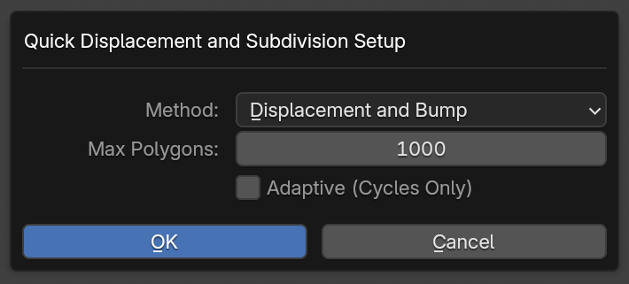|
|:--:|
| Quick Displacement Setup Options | {align=center}

Options that available for `Quick Displacement Setup`:

- **Method**: To set the displacement method of the current active material.
- **Max Polygons**: Will set the subdivision surface or multires modifiers levels based on `Max Polygons` number. The input is in thousand, so 1000 means 1 million polygons.
- **Adaptive (Cycles Only)**: Will enable adaptive subvision that only works on Cycles renderer. This can improve displacement details, but will increase load time when entering render view.
- **Dicing Rate** : Will appear if adaptive is enabled. Dicing rate is the number of pixels on screen that will determine mesh subdivision.

Doing displacement setup will also do these things:

- Add subdivision surface modifier to all objects that shared the material if there's no subdivision surface modifier yet.
- Set the subdivision level to reach `Max Polygons` input. Notice that the input is in **thousands**, so 1000 mean 1 million polygons.
- If the object already use multires modifier, it will set the levels of the multires modifier instead.
- If the model is detected using flat shading, the subdivion modifier will use the `Simple` type, otherwise it will use `Catmull-Clark` type subdivision.
- Set the displacement method of the material to the chosen method option, the default is `Displacement and Bump` so the height or vector displacement channel can actually displace the surface.
- By default, if there's height and normal channel, height channel output is not accessible. Doing displacement setup will make it available.
- Create displacement node if there's height channel exists and connect the output of the height channel to the displacement node.
- Create vector displacement node if there's vector displacement channel exists and connect the output of the vector displacement channel to the vector displacement node.
- The displacement and vector displacement node will connect to the active material output and if there are both of them, `Add Vector` node will be added.
- All the displacement nodes will only be added if they're don't exist yet, so it's safe to do `Quick Displacement Setup` multiple times to set the target polygons

|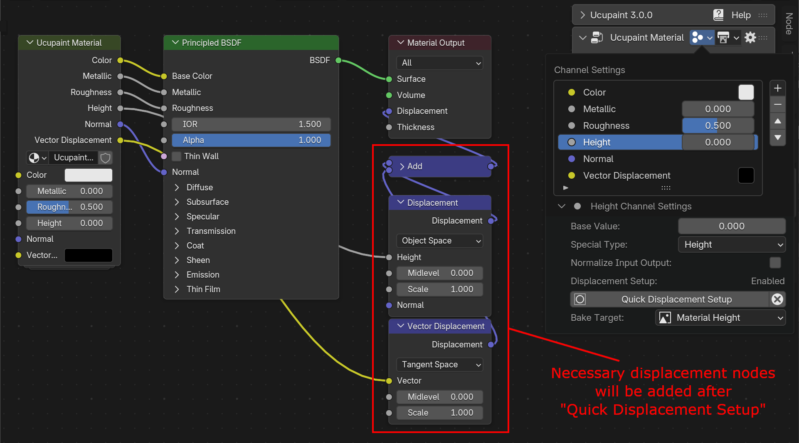|
|:--:|
| Necessary displacement nodes will be created after doing `Quick Displacement Setup` | {align=center}

### Remove Displacement Setup

To remove the displacement setup, there's a button beside the quick displacement setup that has the `X` icon.

|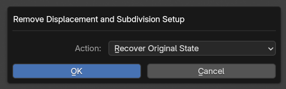|
|:--:|
| Remove Displacement Setup Options | {align=center}

The action input will gives you three options:

- **Recover Original State**: This will keep or remove the subdivision modifier based on the first time you did the `Quick Displacement Setup`
- **Remove Subdivision Modifier**: Will remove any subdivision modifiers that exists on all objects that shared the active material.
- **Keep Subdivision Modifier**: Will keep subdivision modifiers and there's an option to set subdivision level.

Other than doing action to the subdivion modifiers, remove displacement setup will also these things:

- Set the displacement method of the material to `Bump Only` so there will be no displacement on the surface
- If there's height and normal channel, height output is no longer accessible

### Displacement Demo

The video below demonstrates displacement setup in action.

||
|:--:|
| (**TODO: Update needed**) Drawing with Displacement| {align=center}

<!--

## Experimental Features

To access **Experimental Features**, go to: Edit → Preferences → Add-ons → Ucupaint, then enable the Show Experimental Features option in the Ucupaint settings.

||
|:--:|
|Enable Experimental Features| {align=center}

Experimental features will add more options to the Normal channel, which are `Smoother Bump` and `Parallax`.

#### Smoother Bump (Experimental)
This feature is only useful for Blender 2.7x. Smooth Bump makes your bump map appear smoother than Blender’s default, but this comes at the cost of some precision and performance.

||
|:--:|
|Smooth Bump comparison| {align=center}

#### Parallax (Experimental)
The Parallax option lets you create parallax effects when using bump maps. It only works after you bake the normal channel. Please save your file before enabling it, as it may cause Blender to freeze.
Note that parallax effects only work in perspective view.

||
|:--:|
|Parallax comparison| {align=center}

-->
