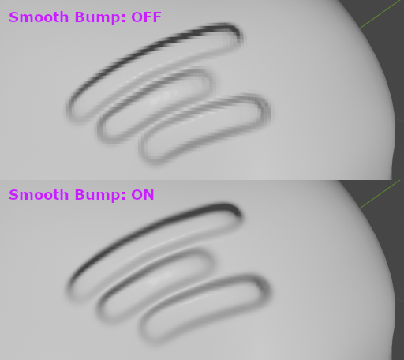
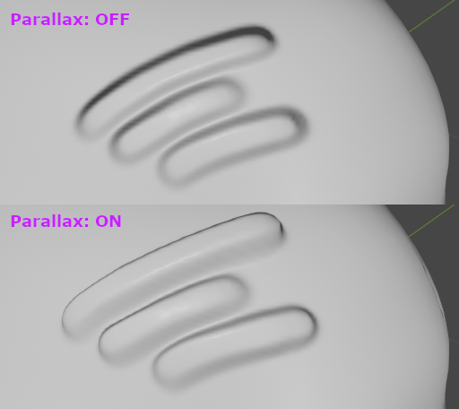

# Channels

## Channel in Ucupaint

A channel in Ucupaint represents a pair consisting of an input and an output within the Ucupaint node. 

||
|:--:|
|The Ucupaint channels input and output (I/O) on the actual node| {align=center}

Each channel has at least one input and one output, but the Normal channel can have multiple inputs and outputs (read [Displacement Setup](#displacement-setup)).

The base color or value of the channel is the default input of the node, as shown in the GIF below.

||
|:--:|
|The base color or value of a channel corresponds to the node’s default input| {align=center}

All inputs and outputs can be freely connected, allowing the Ucupaint node to work with your custom node setups.
 
 
In the channels list panel, you can perform basic actions such as adding, moving up/down, or removing channels.

||
|:--:|
|Channels list panel| {align=center}

!!! note
    You may need to learn how to create a layer before continuing on this page. Click [here](../01.02.layer/#creating-new-layer-quick-guide) to jump to the Layer page

## Adding a New Channel

To add a new channel, use the `+` button next to the channel list. The video below demonstrates how to create an Emission channel in Ucupaint.

<!-- TEMP OLD TEXT: You can create new channel by using the + button on the right of the channels list, it will gives you channel type options, which are RGB, Value, and Normal.
For demonstration, let's try to create new channel that connect to emission socket on the principled bsdf.
Now the popup appears, if you already decided to connect it to principled bsdf, you don't have to manually name the channel, just choose emission on the dropdown, it will automatically set the name of your channel, and if you click ok, it will also connect the sockets. -->

||
|:--:|
|Adding a new channel| {align=center, width=100%}

After creating a new channel, the Ucupaint node will display new input and output sockets corresponding to that channel.

## Channel Types
There are three channel types in Ucupaint: RGB, Value, and Normal.

### RGB Channel Type
An RGB channel consists of three color values: red, green, and blue. You can also enable alpha (Version 2.3.x or lower) to add transparency, which makes the base color transparent by default..

<!-- TODO: Use clamp is not explained yet -->

||
|:--:|
|RGB channel options| {align=center}

#### Alpha channel in Ucupaint 2.3x or lower 

If alpha is enabled, your material will automatically switch to Alpha Dithered method in Eevee. The default alpha value is 0.0, making the background fully transparent.
If you create a layer with a mix blend, it will be placed on top of the transparent background. This can be useful for cases like creating hair planes or vegetation.

||
|:--:|
|Using alpha on color channel| {align=center}

#### Alpha channel in Ucupaint 2.4+

Ucupaint 2.4.0 introduces new dedicated channel for alpha channel, and it pairs to the color channel by default. Demo of the dedicated alpha channel is available in [YouTube video](https://www.youtube.com/watch?v=EEHSA5tfbU0).

### Value Channel Type
Value channels consist of a single value.

||
|:--:|
|Value channel options| {align=center}

### Normal Channel Type
Normal channels consist of a normal vector. You can have only one normal channel per Ucupaint node.

||
|:--:|
|Normal channel options| {align=center}

The **Height Tweak** option is to multiply the value maximum displacement/bump height. It's useful for tweaking the total displacement/bump height without manually adjusting the height for each layer one by one.

#### Displacement Setup

Enabling the Displacement Setup will add extra input and output sockets to the Ucupaint node: `Height`, `Max Height`, and `Vector Displacement`.
These outputs are connected to displacement nodes, which are automatically created when the Displacement Setup is enabled for the first time. While you can connect them to other nodes if needed, they are mainly intended to be used with the given displacement nodes.

||
|:--:|
|Multiple Normal Inputs and Outputs when Displacement Setup is active| {align=center}

Enabling Displacement Setup also does the following:

- Adds a Subdivision Surface modifier to all objects using the same material
- Converts bump maps from Ucupaint layers into real displacement (unless `Write Height` is enabled on that layer, which disables displacement for it)

The **Max Polygons** value controls how much the object is subdivided. It’s measured in thousands; for example, a value of 1000 means up to 1 million polygons.

If you enable **Adaptive Subdivision** (Cycles only), Ucupaint will:

- Enable the Experimental feature set for Cycles render
- Automatically configure adaptive subdivision, which adjusts detail based on the camera view

Adaptive subdivision improves displacement details when you're using Cycles renderer, but may increase load time when entering render view.
<!-- Need more explanation -->

The video below demonstrates how to set up Ucupaint for drawing with displacement

||
|:--:|
|Drawing with Displacement| {align=center}

## Experimental Features

To access **Experimental Features**, go to: Edit → Preferences → Add-ons → Ucupaint, then enable the Show Experimental Features option in the Ucupaint settings.

||
|:--:|
|Enable Experimental Features| {align=center}

Experimental features will add more options to the Normal channel, which are `Smoother Bump` and `Parallax`.

#### Smoother Bump (Experimental)
This feature is only useful for Blender 2.7x. Smooth Bump makes your bump map appear smoother than Blender’s default, but this comes at the cost of some precision and performance.

||
|:--:|
|Smooth Bump comparison| {align=center}

#### Parallax (Experimental)
The Parallax option lets you create parallax effects when using bump maps. It only works after you bake the normal channel. Please save your file before enabling it, as it may cause Blender to freeze.
Note that parallax effects only work in perspective view.

||
|:--:|
|Parallax comparison| {align=center}
