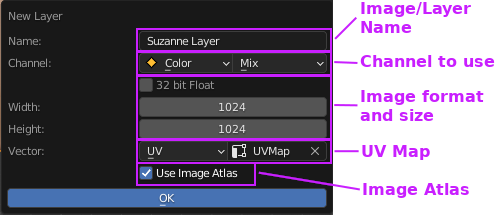
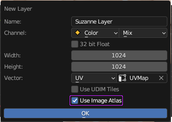

# Layer

You can access layers on the layers panel

||
|:--:|
|Layers list panel| {align=center}

## Creating New Layer (Quick Guide)

You can create new layer by press '+' button, there is various layer type that can help you finish your texturing process.

||
|:--:|
|New layer options| {align=center}

Let's try to use the "image" type. With this layer type, we can draw textures like usual. FYI, **All images generated by Ucupaint will automatically packed when you save your blend file.**
You'll be given this couple of options

||
|:--:|
|New image layer dialog box| {align=center}

Those options are mostly obvious except for image atlas, more details about image atlas is explained [here](#image-atlas).
If you okay with the settings, just click ok. Now you have one image layer available to paint.

||
|:--:|
|Painting on an image layer| {align=center}

The layers feature works like the layer on the regular image editor software. So, if we create another layer and draw over the new layer, it will cover the layer below.

||
|:--:|
|Multiple image layers| {align=center}

!!! note
    Next Quick Guide is about how layer and channel are related, click [here](../01.03.layer-channel/#setting-up-layer-channel-quick-guide) to continue

## Layer Types

There are several layer types that can be used in Ucupaint:

### Image

You can create a new image or open an image as a layer.

#### Image Atlas

When your create new image using Ucupaint, it will give you option to use image atlas.

||
|:--:|
|Image atlas checkbox on new image layer options| {align=center}

If you turned on Image Atlas, newly created layer will use portion of larger image. Since blender material has limited number of images that can be used in a material (8-16 depending on your system), image atlas will use special image that can be used as several layer or masks at the same time. The system works automatically, so you don't have to worry about it.

### Vertex Color

Vertex color can be used for a layer. There's also special vertex color editor on edit mode

||
|:--:|
|Vertex color editor on edit mode| {align=center}

### Solid Color

Solid Color layer contains only single color, can be useful if you want to paint the mask first then edit the solid color later

||
|:--:|
|Solid color layer| {align=center}

### Background

Backgound will use your base color & alpha settings as layer, it can be useful to create holes on the surface

### Fake Lighting

Fake lighting will calculate fake lighting based on given vector and matrix. If you're using camera space, it can be useful for fresnel effect. Be aware if you're using camera space, the baked channel will be static

### Group

Group layer can combine several layers into one layer and add mask or modifier on top of it. This can be really slow if you're using many layers and channels at the same time

### Blender Generated Textures

You can use Blender generated texture as a layer, for example Noise, Magic, Brick, Voronoi, etc.

### Baked Images

You can use baked texture as layer, for example AO, Cavity, Bevel. Be aware that baking process may take a while to finish depending on your system and settings.

### Layer Vector

At default, layer will use UVMap as vector input, but you can change it to other vector type like generated

|![[pic: vector options]](source/03.layer.09.png)|
|:--:|
|Types of layer vector| {align=center}

Be aware that if you're using dynamic vector like camera or window, the baked channel textures will still be static

### Transformation Vector

You can transform your vector by using this UI

|![[gif: offset/rotate/scale image/generated layer]](source/03.layer.10.gif)|
|:--:|
|Vector transformation options| {align=center}

Be aware you can't transform image atlas layer since it shares image with other layer/mask

### Change layer type

You can change the layer type to other layer type and retain it's mask and modifier settings. Use this button below to change layer type

|![[pic: change layer type button]](source/03.layer.11.png)|
|:--:|
|Change layer type options| {align=center}

