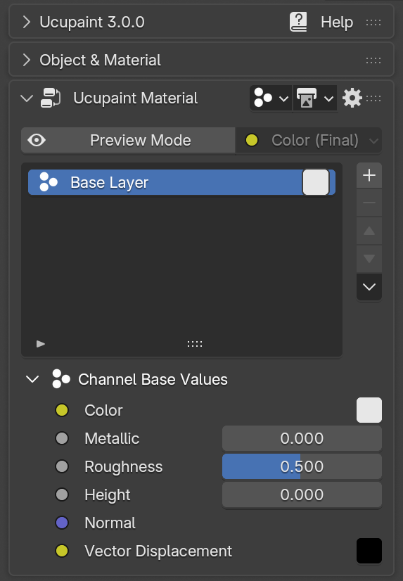
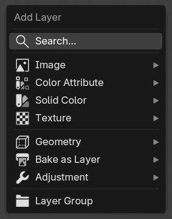
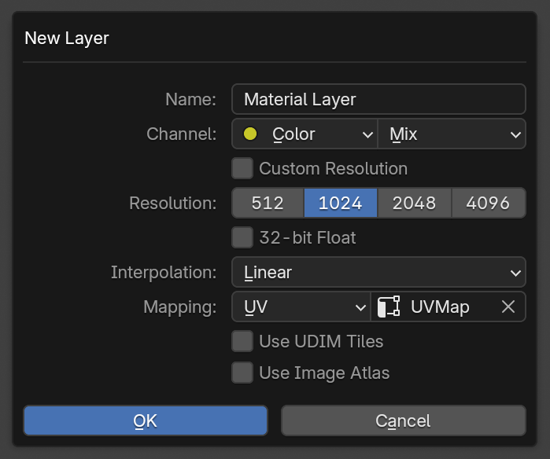
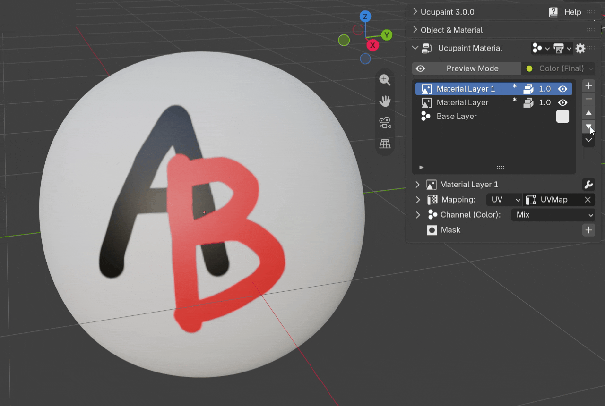
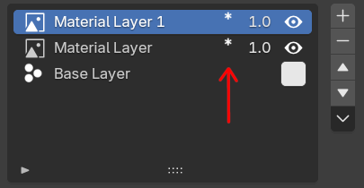
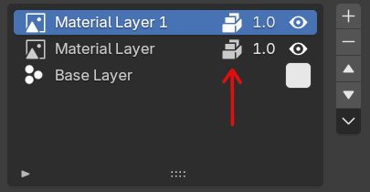
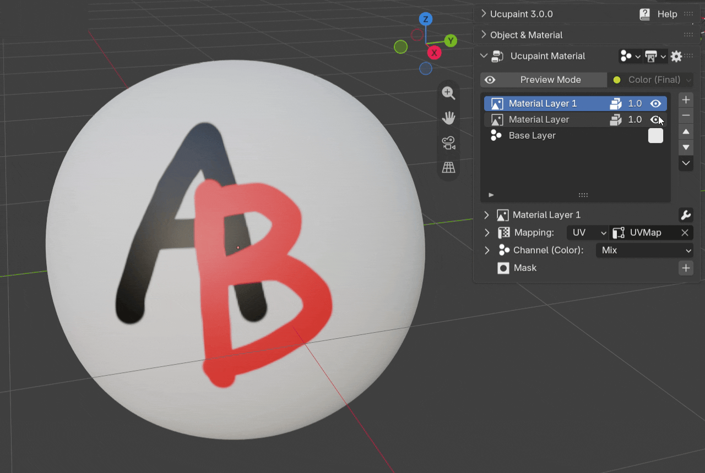
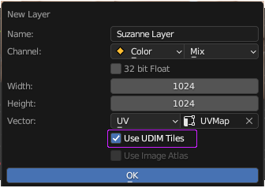
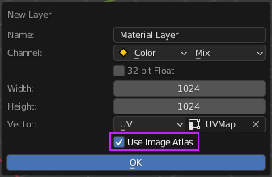

# Layer

Ucupaint UI centered around the layers, after creating ucupaint node, Ucupaint UI will show the layer list with Base layer as the first layer.

||
|:--:|
|Layers list of Ucupaint. It will have at least a base layer | {align=center}

## Base Layer

Base layer is the channel input values of the Ucupaint node, which can also be accessed in the [channel settings](../01.01.channel/#channel-settings). Base layer is always at the bottom of the layer stack and can't be removed.

## Add New Layer <!-- (Quick Guide) -->

You can add new layers by pressing the `+` button. There are various layer types that can help you finish your texturing process.

||
|:--:|
|Add layer menu| {align=center}

If you choose `Image > New Image`, a dialog box will appear.

### New Image Layer Options

||
|:--:|
|New image layer dialog box| {align=center}

Here are the explanations of the options when creating new image layer:

- **Name**: Name of the layer, which also name of the created image.
- **Channel**: Channel that will be used the layer for.
- **Resolution**: Resolution of the created image.
- **32-bit Float**: More precision to image created, useful for painting height, but will use a lot more disk space.
- **Interpolation**: Pixel filtering interpolation that will be used for the render. Choose `Closest` if you want to create pixel art textures and `Cubic` if you want to paint the height. Everything else will be enough by using the default `Linear`.
- **Mapping**: Texture Mapping method that will be used for render. (*TODO: More explanations of all the Mapping types on a separate page*)
- **Use UDIM Tiles**: Create UDIM tiles based on the UV Map chosen. This will automatically enabled if you choose an UVMap that has UV islands placed outside 0.0-1.0 range. To disable this automatic UDIM detection, you can disable `Enable Auto UDIM Detection` in addon preferences. (*TODO: More explanation about UDIM in separate page *)
- **Use Image Atlas**: Use shared image atlas image for multiple layers and masks. This is to circumvent maximum image limit of Blender's OpenGL renderer mentioned in [Pink Material page](../01.11.extras)

<!--
Those options are mostly obvious, except for image atlas, more details about image atlas can be found [here](#image-atlas).
Once you're happy with the settings, just click ok. Now you have one image layer available to paint on.
-->

## Painting an Image Layer

After creating new image layer, you can start painting to the image layer by go to Texture Paint mode. You can do that by changing `Object Mode` to `Texture Paint` on Blender viewport menu or by pressing `Ctrl+Tab` and choose `Texture Paint`.

||
|:--:|
| Example of creating image layers and painting them | {align=center}

Layer in Ucupaint works like a layer in any other image editing software. So if we create another layer and draw over it, it will cover the layer below.

## Reordering Layers

You can reorder active layer by clicking the arrow buttons beside the layer list.

||
|:--:|
| Reordering layers | {align=center}

## Saving the Image Layers

After you painted a layer, you'll notice that there is asterisk beside the layer name, that means the image is edited and haven't been saved yet. If you save the blend file, all images used in Ucupaint will automatically saved or packed inside the blend file. In Blender 5.2 or newer, there is prompt to tell you there unsaved images, but whether you choose to click the toggle or not, when saving the blend file, Ucupaint will always save all the images used in Ucupaint node(s).

|||
|:--:|:--:|
| Asterisk icons mean images are edited but not saved yet | Packed icons mean images are packed in the blend file | {align=center}

<!--
!!! note
    Next Quick Guide is about how layers and channels are related, click [here](../01.03.layer-channel/#setting-up-layer-channel-quick-guide) to continue
-->

## Layer Parameters And Options

### Layer Visibility

The eye icon in the layer list is to set the layer visibility.

||
|:--:|
| Toggling on and off layer visibility | {align=center}

### Layer Opacity

Layer opacity is controlled by the slider on the left of the layer visibilty icon.

||
|:--:|
| Layer opacity slider in action  | {align=center}

### Layer Mapping

A layer will use UV mapping by default, but you can change it to another mapping types. (*TODO: All mapping types explained*)

|![[pic: vector options]](./source/03.layer-mapping.png)|
|:--:|
|Types of layer vector| {align=center}

Be aware that if you're using a dynamic mapping like camera or window, the baked channel images will still be static.

### Mapping Transformation

You can transform your mapping using translate, rotation, and scale sliders.

||
|:--:|
|Mapping transformation demo| {align=center}

Mapping transformation is only available for non-decal mapping.

### Layer Source

You can change the layer source to a different one and retain it's mask and modifier settings. Use this button to change the layer type.

|![[pic: change layer type button]](./source/03.layer-source-options.png)|
|:--:|
|Change layer type options| {align=center}

### Renaming Layer

To rename a layer, double click the name of the layer in the layer list and type the name of the layer. If your layer is an image layer, you'll actually also renaming your image name.

||
|:--:|
|Renaming layer| {align=center}

If you already learnt about mask, make sure you select the active data to be the layer otherwise you'll rename the mask or custom data.

## Layer Types

There are several layer types that can be used in Ucupaint.

### Image

Other than creating new layer image explained [here](#new-image-layer-options), you can also open image from disk, or open existing image in current blend file. (*TODO: Open Image from materials/Open images to single layers explanations*)

<!--

#### UDIM

There's an option to use UDIM when you create a new image layer. This option will automatically be turned on if the selected UV map has UV islands outside of the first tile.

||
|:--:|
|UDIM checkbox on new image layer options| {align=center}

#### Image Atlas

When you create a new image using Ucupaint, it will give you the option to use an image atlas.

||
|:--:|
|Image atlas checkbox on new image layer options| {align=center}

If you turn on Image Atlas, the newly created layer will use a portion of a larger image. Since Blender materials have a limited number of images that can be used in a material (8-55, depending on your system, more info [here](../01.11.extras)), the image atlas will use a special image that can be used as several layers or masks at the same time. This system works automatically, so you don't have to worry about it.

-->

### Color Attribute

Color attribute can be used as a layer. There's also a special color attribute editor in edit mode.

||
|:--:|
| (*TODO: Update Needed*) Vertex color editor on edit mode| {align=center}

### Solid Color

Solid Color layer contains only a single color, can be useful if you want to paint the mask first, then edit the solid color later.

||
|:--:|
| (*TODO: Update Needed*) Solid color layer| {align=center}

<!--
### Background

Backgound will use your base color & alpha settings as a layer, it can be useful to create holes on the surface.

-->

### Geometry types

#### Fake Lighting

Fake lighting will calculate fake lighting based on a given vector and matrix. If you're using camera space, it can be used for a fresnel effect. Be aware that if you're using camera space, the baked channel will be static.

#### Ambient Occlusion

#### Edge Detect

### Adjustment

### Texture

You can use Blender's generated textures as a layer, for example Noise, Magic, Brick, Voronoi, etc.

### Bake to Layer Types

You can use a baked texture as a layer, for example AO, Cavity, Bevel. Be aware that the baking process may take a while to finish, depending on your system and settings. Various bake to layer types are explained [here](../01.07.bake-to-layer)

<!-- TODO: Realtime AO & Edge Detect -->

### Group

Group layer can combine several layers into one layer and add a mask or a modifier on top of it. This can be really slow if you're using many layers and channels at the same time.

