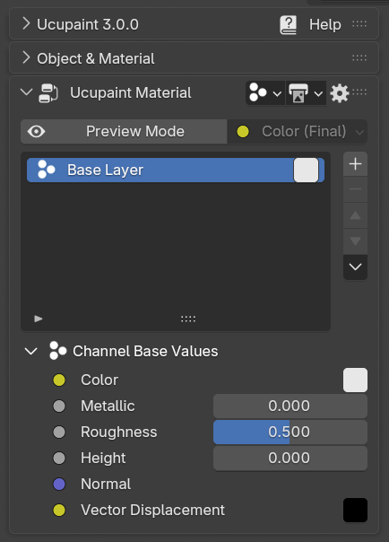
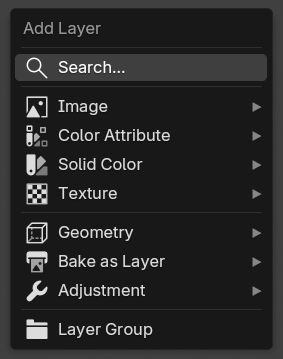
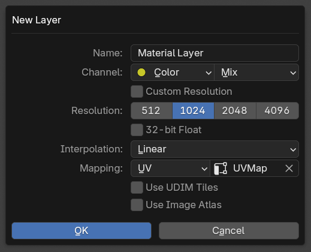
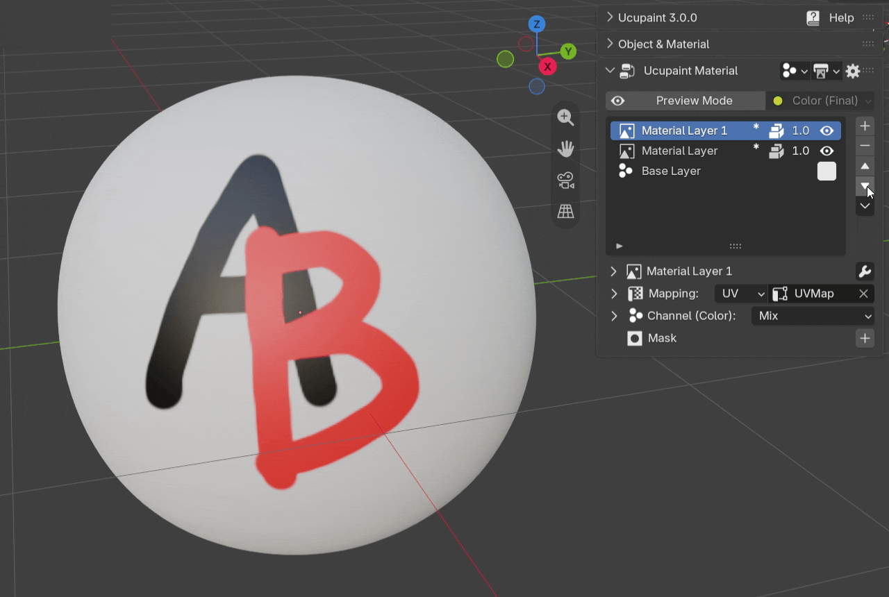
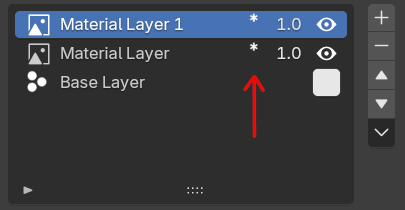
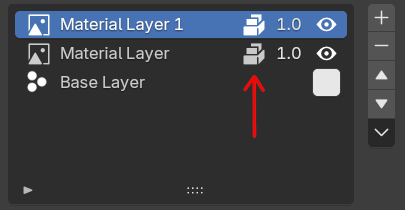
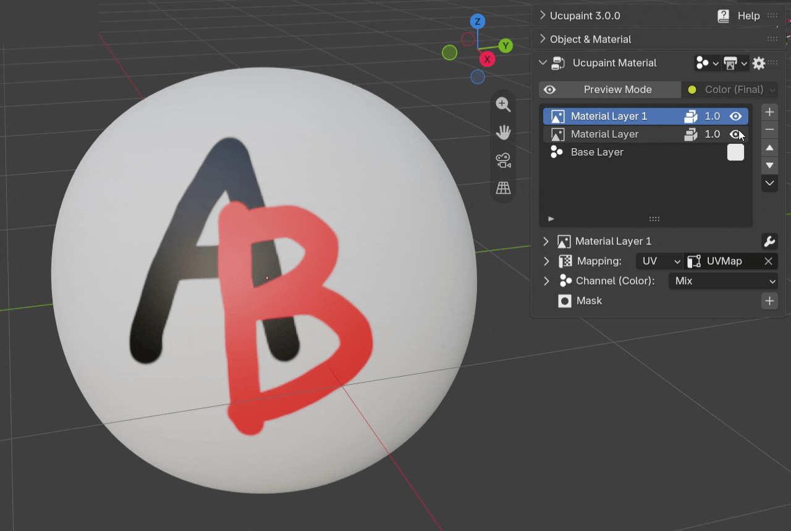
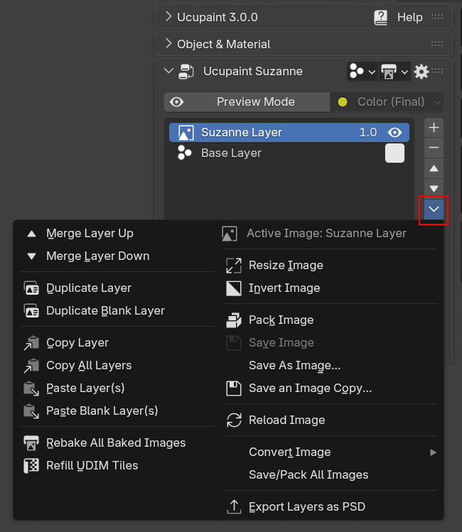

# Layer

Ucupaint UI centered around the layers, after creating ucupaint node, Ucupaint UI will show the layer list with Base layer as the first layer.

||
|:--:|
|Layers list of Ucupaint. It will have at least a base layer | {align=center}

## Base Layer

Base layer is the channel input values of the Ucupaint node, which can also be accessed in the [channel settings](../01.01.channel/#channel-settings). Base layer is always at the bottom of the layer stack and can't be removed.

## Add New Layer <!-- (Quick Guide) -->

You can add new layers by pressing the `+` button. There are various layer types that can help you finish your texturing process.

||
|:--:|
|Add layer menu| {align=center}

If you choose `Image > New Image`, a dialog box will appear.

### New Image Layer Options

||
|:--:|
|New image layer dialog box| {align=center}

Here are the explanations of the options when creating new image layer:

- **Name**: Name of the layer, which also name of the created image.
- **Channel**: Channel that will be used the layer for.
- **Resolution**: Resolution of the created image.
- **32-bit Float**: More precision to image created, useful for painting height, but will use a lot more disk space.
- **Interpolation**: Pixel filtering interpolation that will be used for the render. Choose `Closest` if you want to create pixel art textures and `Cubic` if you want to paint the height. Everything else will be enough by using the default `Linear`.
- **Mapping**: Texture Mapping method that will be used for render. (*TODO: More explanations of all the Mapping types on a separate page*)
- **Use UDIM Tiles**: Create UDIM tiles based on the UV Map chosen. This will automatically enabled if you choose an UVMap that has UV islands placed outside 0.0-1.0 range. To disable this automatic UDIM detection, you can disable `Enable Auto UDIM Detection` in addon preferences. (*TODO: More explanation about UDIM in separate page *)
- **Use Image Atlas**: Use shared image atlas image for multiple layers and masks. This is to circumvent maximum image limit of Blender's OpenGL renderer mentioned in [Pink Material page](../01.11.extras)

<!--
Those options are mostly obvious, except for image atlas, more details about image atlas can be found [here](#image-atlas).
Once you're happy with the settings, just click ok. Now you have one image layer available to paint on.
-->

## Painting an Image Layer

After creating new image layer, you can start painting to the image layer by go to Texture Paint mode. You can do that by changing `Object Mode` to `Texture Paint` on Blender viewport menu or by pressing `Ctrl+Tab` and choose `Texture Paint`.

||
|:--:|
| Example of creating image layers and painting them | {align=center}

Layer in Ucupaint works like a layer in any other image editing software. So if we create another layer and draw over it, it will cover the layer below.

## Reordering Layers

You can reorder active layer by clicking the arrow buttons beside the layer list.

||
|:--:|
| Reordering layers | {align=center}

## Saving the Image Layers

After you painted a layer, you'll notice that there is asterisk beside the layer name, that means the image is edited and haven't been saved yet. If you save the blend file, all images used in Ucupaint will automatically saved or packed inside the blend file. In Blender 5.2 or newer, there is prompt to tell you there unsaved images, but whether you choose to click the toggle or not, when saving the blend file, Ucupaint will always save all the images used in Ucupaint node(s).

|||
|:--:|:--:|
| Asterisk icons mean images are edited but not saved yet | Packed icons mean images are packed in the blend file | {align=center}

<!--
!!! note
    Next Quick Guide is about how layers and channels are related, click [here](../01.03.layer-channel/#setting-up-layer-channel-quick-guide) to continue
-->

## Layer Parameters And Options

### Layer Visibility

The eye icon in the layer list is to set the layer visibility.

||
|:--:|
| Toggling on and off layer visibility | {align=center}

### Layer Opacity

Layer opacity is controlled by the slider on the left of the layer visibilty icon.

||
|:--:|
| Layer opacity slider in action  | {align=center}

### Layer Mapping

A layer will use UV mapping by default, but you can change it to another mapping types. (*TODO: All mapping types explained*)

|![[pic: vector options]](./media/layer/layer_mapping.png)|
|:--:|
|Types of layer vector| {align=center}

Be aware that if you're using a dynamic mapping like camera or window, the baked channel images will still be static.

### Mapping Transformation

You can transform your mapping using translate, rotation, and scale sliders.

||
|:--:|
|Mapping transformation demo| {align=center}

Mapping transformation is only available for non-decal mapping.

### Layer Source

You can change the layer source to a different one and retain it's mask and modifier settings. Use this button to change the layer type.

|![[pic: change layer type button]](./media/layer/layer_source_options.png)|
|:--:|
|Change layer type options| {align=center}

### Renaming Layer

To rename a layer, double click the name of the layer in the layer list and type the name of the layer. If your layer is an image layer, you'll actually also renaming your image name.

||
|:--:|
|Renaming layer| {align=center}

If you already learnt about mask, make sure you select the active data to be the layer otherwise you'll rename the mask or custom data.

## Layer Special Menu

Layer special menu can be accessed below the layer move up & down button. It contains many operators contextual to the selected layer and selected image data.

||
|:--:|
|Layer Special Menu| {align=center}

### Merge Layers

There are two operators for merging layer, `Merge Layer Up` and `Merge Layer Down`. Currently this only work with image layer as the active layer. The merging process is using blender bake system internally so it can take a while if you're using large resolution and UDIM. 

The options for merge layers are:

- **Main Channel**: Channel for merge reference, you can only choose one.
- **Apply Modifiers**: This will apply the modifiers in the active layer.
- **Apply Neighbor Modifiers**: The merge process will include the modifiers of the neighbor/other layer for the merging.

### Duplicate Layer

There are two operators for duplicating a layer, `Duplicate Layer` is for duplicating a copy of the active layer with all the pixel data if it's an image layer and all the mask pixel data (if there's a image mask) and all the modifiers and settings. `Duplicate Blank Layer` will duplicate the layer with all the modifiers and settings, but all the layer and mask pixels data will be blank.

The options for duplicating a layer are:

- **Duplicate Packed Images**: Only available if there's packed image data in the active layer. This will duplicate the packed image into new image, disabling this will reuse the image date in the duplicated layer.
- **Duplicate Images on disk**: Only available if there's an image sourced externally from disk in the active layer. Enabling this will duplicate the actual image into new file in disk.

### Copy & Paste Layers

There are two copy layer operator, `Copy Layer` will only copy active layer and `Copy All Layers` will copy all layers in active Ucupaint node. You can only paste the layer in the same blend file opened, as you cannot paste the layer in different blender instance for example.

For pasting the layer, there's `Paste Layer` and `Paste Blank Layer(s)`, paste blank behave similarly to duplicate blank, it will paste the layer with all the settings and modifiers, but the image data will be blank. There will be also option similar like duplicate like `Duplicate Packed Images` and `Duplicate Images on disk` depending if there are packed images or ondisk images.

Also if there's a copied baked image layer/mask, there will be an option to `Rebake Baked Images`, so if the layer is pasted to objects with different shape, you can immidiately rebake the images.

### Extra Operators

#### Rebake All Baked Images

The operator `Rebake All Baked Images` will rebake all baked image layers and masks. More explanation can be found in the [bake as layer/mask page](../01.07.bake-to-layer#batch-rebake)

#### Refill UDIM Tiles

If you already have many image layers/masks that uses UDIM and want to add new UDIM tiles since you modified the UV Map, you can use `Refill UDIM Tiles` to quickly add new UDIM tiles based on the new UV Map. (*TODO: Dedicated explanation about UDIM workflow in Ucupaint*)

### Contextual Image Operators

Some of operators in the layer special menu is only applied to the selected active image data. Those operators are `Resize Image`, `Invert Image`, `Pack Image`, `Save Image`, and `Convert Image`.

#### Convert Image

In `Convert Image` submenu, there some operators that you can use to convert images.

- **Convert to Float/Byte Image**: You can convert to high/lower precision image.
- **Convert to UDIM/Non-UDIM Image**: You can convert the active non-UDIM image to become UDIM image or vice versa
- **Convert to Image Atlas**: Convert the active image to use image atlas so it will shares image data to other image layers and masks. Or converting back to standard image from image atlas.
- **Convert All Images to Image Atlas**: Convert all images used in current Ucupaint node to use image atlas. This will only applied to packed images and images that has no transformation mapping.

### Export Layers as PSD

Exporting to PSD layers currently only available in Ucupaint Plus. More explanation about this can be found in [the dedicated page](../psd-export-import/).

## Layer Types

There are several layer types that can be used in Ucupaint.

### Image

Other than creating new layer image explained [here](#new-image-layer-options), you can also open image from disk, or open existing image in current blend file. (*TODO: Open Image from materials/Open images to single layers explanations*)

### Color Attribute

Color attribute can be used as a layer. There's also a special color attribute editor in edit mode.

||
|:--:|
| Adding new color attribute layer and edit it in edit mode | {align=center}

You can assign selected vertex/polygons to certain color in edit mode. There will be buttons to assign them with `White`, `Black` or custom `Color`. The color assigned in vertex select mode will bleed through all the corner of the connected polygons. In polygon select mode, the assigned color will only affected the selected polygons.

### Solid Color

Solid Color layer contains only a single color, can be useful if you want to paint the mask first, then edit the solid color later.

||
|:--:|
| Solid color layer demo | {align=center}

### Geometry types

#### Fake Lighting

Fake lighting will calculate fake lighting based on a given vector and matrix. If you're using camera space, it can be used for a fresnel effect. Be aware that if you're using camera space, the baked channel will be static.

#### Ambient Occlusion

Ambient occlusion will create a dark color around the corner area for the objects. This layer is heavy to use, so it's better to bake it as image after you finish tweaking the settings.

#### Edge Detect

Edge detect will add white color around the edge proximity of the mesh. Like Ambient Occlusion layer, this is a heavy realtime layer to use, so it's better to bake it as image if you finish tweaking the settings.

### Adjustment

Adjustment layer actually just a layer that use previous layer as the source data, then it will add modifier on top of it. More explanation can be found in the [modifier page](../01.05.modifier#adjustment-layer).

### Texture

You can use Blender's generated textures as a layer, for example `Noise`, `Magic`, `Brick`, `Voronoi`, etc.

### Bake to Layer Types

You can use a baked texture as a layer, for example AO, Cavity, Bevel. Be aware that the baking process may take a while to finish, depending on your system and settings. Various bake to layer types are explained [here](../01.07.bake-to-layer)

<!-- TODO: Realtime AO & Edge Detect -->

### Group

Group layer can combine several layers into one layer and add a mask or a modifier on top of it. This can be really slow if you're using many layers and channels at the same time.

||
|:--:|
| Layer group demo | {align=center}
