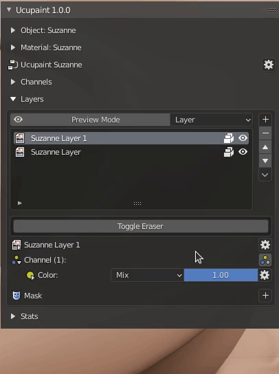
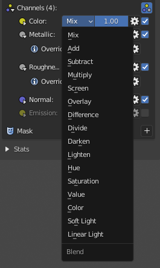

# Layer Channel

The layer channel is a bridge between layer and channel. One layer can affect multiple channels, and you can choose which channel your layer will affect.

## Setting up layer channel (Quick Guide)

By default, you can only see enabled channels, which is is color channel by default. You can show other available channels using the button below.

||
|:--:|
|Show all channels toggle| {align=center}

Now, let's try to add a metal effect to one of the layers. The metal effect can be obtained by adjusting the value of the metallic and roughness channel. First, you can set the metallic and roughness is active on the layer channel panel.

||
|:--:|
|Enabling metallic and roughness on layer channels| {align=center}

By doing this, the value of layer will affect both metallic and roughness at the same time, which probably aren't ideal, since metallic value usually sit either on 0.0 or 1.0, and painted layer is not exactly white.
To resolve this, you can override the value of the channel, by using the toggle as demonstrated below

||
|:--:|
|Using layer channel override| {align=center}

Override will replace all values on the painted area on each specific channel.
Now let's try to use normal channel, if you enable it, it will use the layer as bump map by default, as showed below

||
|:--:|
|Enable normal on layer channels and editing its height| {align=center}

!!! note
    Next Quick Guide is about mask, click [here](../01.04.mask/#setting-up-mask-quick-guide) to continue

## Layer channel blending
You can change blending of each layer channel.

||
|:--:|
|Layer channel blending options| {align=center}

For normal channel it will have different options

||
|:--:|
|Layer channel blending options for normal are different| {align=center}

## Layer channel override

You can change specific layer channel to specific value or even using other image or texture. The layer channel will still use the alpha, mask, and transformation of the main layer. This can be really useful to load PBR textures into single layer. Below is example of how to do it.

||
|:--:|
|Using layer channel override to load PBR textures| {align=center}

If loading textures one by one is cumbersome, there's 'Open Images into Single Layer', this operator will read selected images names to determine which channels it's belong to then load them into single new layer. You can see how to do it in video below.

||
|:--:|
|Using Open Images to Single Layer to quickly load PBR textures| {align=center}

