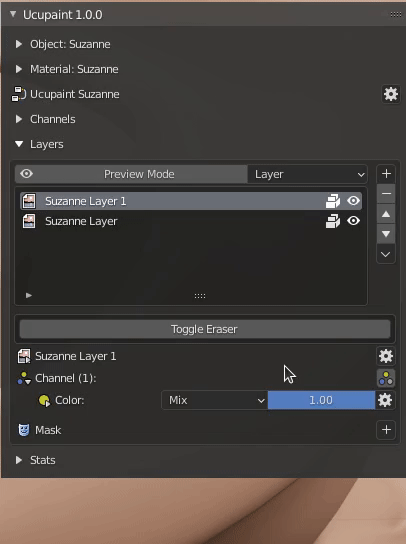
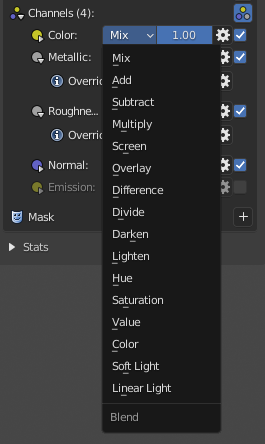
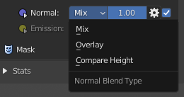

# Layer Channel

The layer channel is a bridge between layers and channels. You can choose which channel(s) your layer will affect.

## Layer channel blending

By default, you’ll get the option to change the blending mode of the channel you select when you create the new layer.

||
|:--:|
| Changing blending mode of default enabled channel | {align=center}

## Enabling multiple channels in a layer

If you click the triangle you'll see all the channels that you can choose.

To enable the channel in a layer, you can just tick the checkmark toggle beside the channel.

You can use multiple channels at the same time and the default value that contribute to the channel is the layer color.

(*TODO: enable metallic and roughness channels on an image layer.*)

## Change layer channel source

By default the layer color is the data that is used to contribute to channel, but you can change the source to a different data. <!-- while keeping the painted area intact.-->

For multiple channels in a single layer, one of the most useful source is custom value, it will change the painted area to use only a single value, useful to set the metallic and roughness.

(*TODO: change layer channel source to custom value and change the value.*)

## Setting up layer channels (Quick Guide)

By default, you can only see enabled channels, which is the color channel by default. You can show other available channels using the button below.

||
|:--:|
|Show all channels toggle| {align=center}

Now, let's try to add a metal effect to one of the layers. The metal effect can be achieved by adjusting the value of the metallic and roughness channels. First, you can set the metallic and roughness as active on the layer channel panel.

||
|:--:|
|Enabling metallic and roughness in layer channels| {align=center}

By doing this, the value of the layer will affect both metallic and roughness at the same time, which probably isn't ideal, since metallic value usually sits either on 0.0 or 1.0, and a painted layer is not exactly white.
To resolve this, you can enable override of the layer channel. Override will replace the channel value on the painted area.

||
|:--:|
|Using layer channel override| {align=center}

## Using layer normal channel

Now let's try to use a layer normal channel, if you enable it, it will use the layer as bump map by default, as shown below.

||
|:--:|
|Enabling normal in layer channels and editing its height| {align=center}

!!! note
    Next Quick Guide is about mask, click [here](../01.04.mask/#setting-up-mask-quick-guide) to continue

## Layer channel blending
You can change blending of each layer channel.

||
|:--:|
|Layer channel blending options| {align=center}

For the normal channel it will have different options.

||
|:--:|
|Layer channel blending options for the Normal type are different| {align=center}

## Layer channel override

You can set a specific layer channel to be a specific value or even use another image or texture. The layer channel will still use the alpha, mask, and transformation of the main layer. This can be really useful to load PBR textures into a single layer. Below is an example of how to do it.

||
|:--:|
|Using layer channel override to load PBR textures| {align=center}

If loading textures one by one is cumbersome, there's 'Open Images into Single Layer', this operator will read selected image names to determine what channel it belongs to and then load them into a single new layer. You can see how it works in video below.

||
|:--:|
|Using Open Images to Single Layer to quickly load PBR textures| {align=center}

