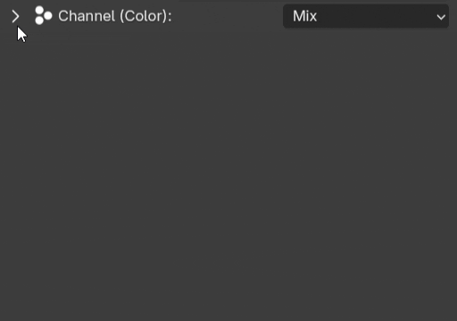
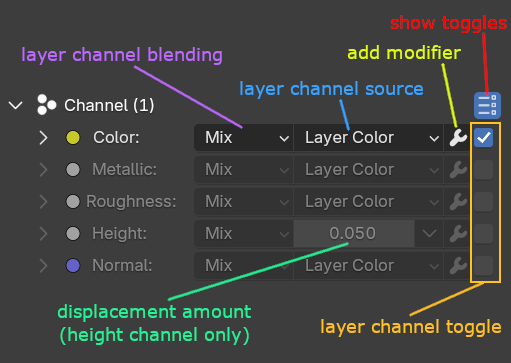
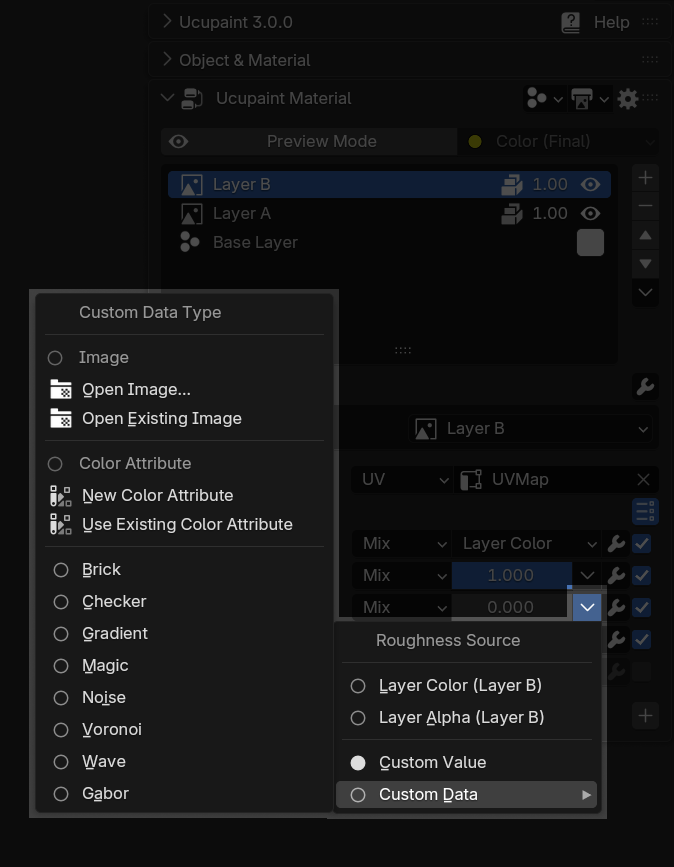
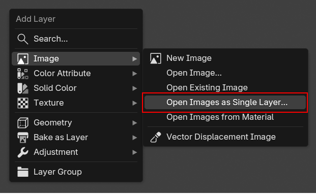

# Layer Channel

The layer channel is a bridge between layers and channels. You can choose which channel(s) your layer will affect.

## Layer channel blending

By default, you’ll get the option to change the blending mode of the channel you select when you create the new layer.

||
|:--:|
| Changing blending mode of default enabled channel | {align=center}

## Layer channel panel

You can do more than blending for the layer channel, if you click the triangle you'll see all the channels options. <!-- You can toggle which channel the layer will affect to, what data will you use for the channel, and more. -->

||
|:--:|
| Layer channel panel has multiple levels of UI dropdown| {align=center}

Every channel that you can use in a layer has its own blending, sources, and modifier stacks.

||
|:--:|
| Layer channels legends | {align=center}

## Enabling layer channel(s)

To enable the channel in a layer, you can just tick the checkbox toggle beside the channel. You can enable multiple channels at the same time and the default value that contribute to the channel is the layer color.

||
|:--:|
| Enabling multiple layer channels | {align=center}

## Change layer channel source

By default the layer color is the data that is used to contribute to channel, but you can change the source to a different data. <!-- while keeping the painted area intact.-->

### Change layer channel source to use custom value

For multiple channels in a single layer, one of the most useful source is custom value, it will change the painted area to use only a single value, useful to set the metallic and roughness of the painted area independently.

||
|:--:|
| Change layer channel source to custom value | {align=center}

### Change layer channel source to use custom data

Other than custom value, you can also use custom data for the channel source.

||
|:--:|
| Custom data that you can choose | {align=center}

Custom data can be an image, color attribute, or textures.

||
|:--:|
| Changing layer channel source to use noise | {align=center}

#### Load PBR images

Using custom data, especially images can be useful to assign each channel to the respective image from PBR image texture packs. There are a lot of sites that you can use to download PBR texture images, like [ambientCG](https://ambientcg.com/) or [Poly Haven](https://polyhaven.com/).

You can either use `Open Image` to load an image as a layer channel custom data one by one, or you also automatically assign images to respective channel by choosing `Open Images as Single Layer` when creating new layer.

||
|:--:|
| `Open Images as Single Layer` menu when creating new layer| {align=center}

`Open images as single layer` will detect the image name suffix and determine which image should be assigned to which channel.

||
|:--:|
| Load PBR images using `Open Images as Single Layer` | {align=center}

