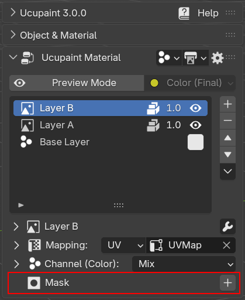
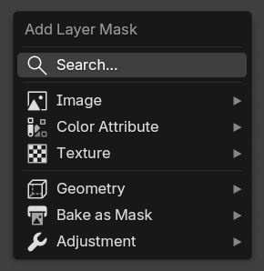
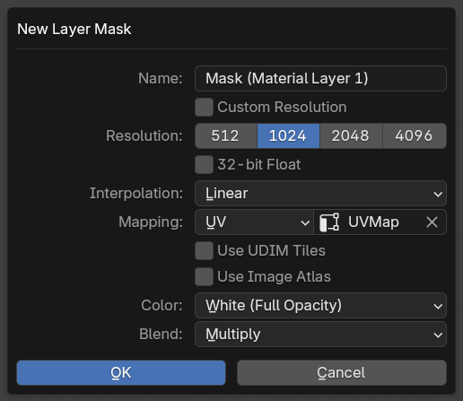
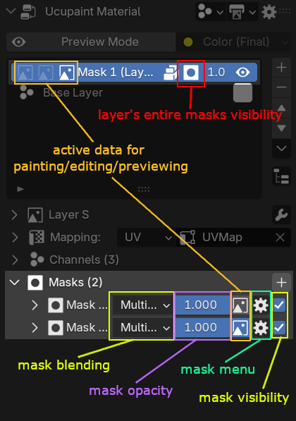
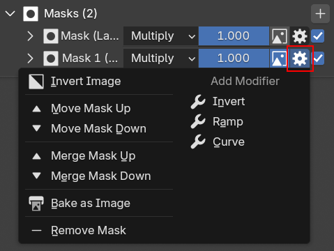
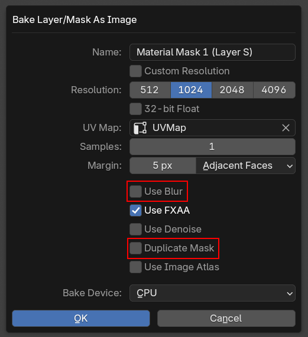
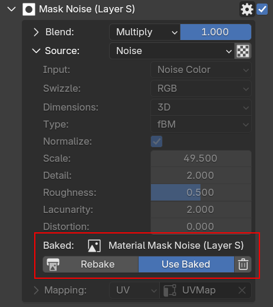
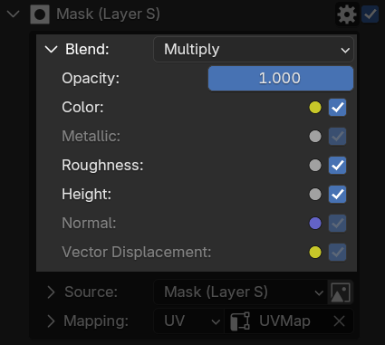

# Mask

Masks can be useful to hide or show certain part of a layer. It uses value 1.0 (white) as visible and 0.0 (black) as transparent. You can access layer masks below the layer channels.

||
|:--:|
|Layer masks panel| {align=center}

## Add New Mask

To add a new mask just press the '+' button and you'll be given an options menu with many mask types.  More details about layer mask types can be accessed [here](#mask-types). You can add as many masks as you like in a single layer, and they doesn't have to be using the same mask types.

||
|:--:|
|New layer mask menu| {align=center}

### New Image Mask Options

If you choose `Image > New Image`, a dialog box will appear.

||
|:--:|
|New image mask dialog box| {align=center}

Most of the options are similar to [new image layers options](../01.02.layer/#new-image-layer-options), with some exceptions:

- **Color**: Color of the mask, white for full opacity and black for full transparency.
- **Blend**: Blending of the mask, the default is `Multiply`, which meant the mask will be multiplied to the layer alpha value.

## Painting an Image Mask

Painting image mask is as simple as painting black to hide and painting white to reveal the layer. This is very useful way to non-destructively manipulate your layer.

||
|:--:|
| Adding and painting image masks | {align=center}

## UI related to Mask

If layer has a mask or two, more icons will be visible in the layer list and there will be an icon to enable/disable all masks assigned to the layer.

||
|:--:|
| Explanation of mask-related UI | {align=center}

Every mask their own of blending, opacity, and visibility toggle.

||
|:--:|
| Mask visibility and opacity demo | {align=center}

Icon button in between of the mask opacity and mask menu is to set the active data that will be used for painting (if the mask is an image) or editing (if the mask is an color attributes or color ID). It can also be used for previewing the data (more info in [Preview Mode](../01.06.preview-mode) page)

||
|:--:|
|Switching active data between masks and layer | {align=center}

## Mask Menu

Mask menu contain various operators, like for reordering the masks, merging, removing, baking, and adding modifier specific the the mask.

||
|:--:|
|Menu for reordering masks and other things| {align=center}

## Baking a mask as an image

<!-- Baking a mask as an image has many useful purposes. It can improve performance for procedural textures like noise, voronoi, etc. There's also option to add blur to the baked image. -->
Baking mask as an image is available in mask menu. It will bake all kind of masks with it's mapping to an image. 

||
|:--:|
| Bake mask as image has some special options | {align=center}

Bake mask as an image has similar options to [baking data to a layer/mask](../01.07.bake-to-layer). But it has extra options:

- **Use Blur**: Add blur to the baked image. It uses compositing nodes, so the the blur result is much cleaner than using blur in the mapping options.
- **Duplicate Mask**: The bake result will become a new separate mask.
- **Disable Current Mask**: Only shows if `Duplicate Mask` is enabled. This will make the original mask disabled after baking.

After you baked a mask as an image (unless you choose to duplicate the mask), you can switch back to original unbaked data.

||
|:--:|
| Baked data information and some buttons will appear after baking | {align=center}

The screenshot above is an example of noise mask baked as an image. Notice that all the noise paramaters and mappings are greyed out if you use the baked image. There's also a button to rebake and remove the baked image data.

## Mask Blending

Other than setting the opacity and blend types, there are also options for the mask to only affect specific channels.

||
|:--:|
| Mask blending panel | {align=center}

If you notice in the screenshot above there are some channels that has the darker texts, that means those channels aren't enabled in the layer.

There are many benefits of baking a mask to an image. Some of them are:

- Improve performance for Blender generated textures (Noise, Voronoi, etc) since image has much faster performance than procedural textures
- Adding blur to a Color ID mask will make it possible to be usable for height channel.

<!-- Like with layers, you can edit the source, vector and blending. You can also mask only a specific channel. -->
## Mask Types

<!-- Ucupaint has several mask types that can be used, most of the types are the same like layer types, except for: -->
Ucupaint’s mask types are mostly the same as its [layer types](../01.02.layer/#layer-types), with a few exceptions.

### Color ID

Color ID will use a unique random color ID that will work as a mask. It uses color attribute named `__yp_color_id` to store its color ID, when the color IDs match, then it will be valued 1.0, otherwise it will be valued 0.0. Like color attribute, Ucupaint has special editor to easily edit color IDs in edit mode.

||
|:--:|
| (**TODO: Update Needed**) Using Color ID mask| {align=center}

### Object Index

Object Index will use pass index of an object as a mask.

||
|:--:|
|(**TODO: Update Needed**) Using Object Index Mask| {align=center}

### Backface

Backface will mask out the backface of the surface. *WARNING: This mask type can't be baked*.

