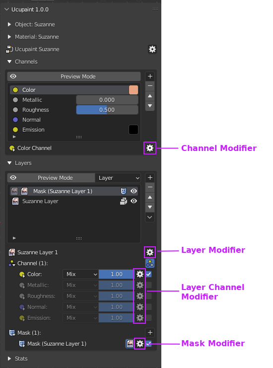
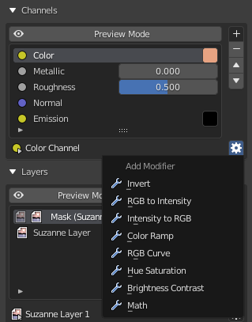

# Modifier

Modifier is useful to add non destructive effect to a layer, mask, layer channel, or the main channel itself.

||
|:--:|
|Various modifier menu locations| {align=center}

Keep in mind that not all modifier types are available in each place. For example, there are only three modifiers on the mask modifier (Invert, Ramp, and Curve).

## Adding Modifier (Quick Guide)

Let's try to add a modifier on the color channel. You can see more details about modifier here (link 6.2). For now we will try using RGB Curve modifier.

||

With the RGB curve modifier applied, you can adjust the output of the color channel with the curve.

||
|:--:|
|Adjusting color with RGB Curve modifier| {align=center}

!!! note
    Final part of Quick Guide is about Baking Channels to textures and save them, click [here](../01.09.bake-Channels.md/) to continue

## Modifier types

- Invert: will invert selectable rgb and alpha value
- RGB to Intensity: will make your rgb of your layer to intensity/alpha and replace layer rgb value itself to single color.
- Intensity to RGB: will make your alpha of your layer to rgb and replace layer alpha value itself to solid value
- Color Ramp: will use layer rgb value to a color ramp
- RGB Curve: will tweak your rgb value using curve
- Hue Saturation: will tweak your rgb value using hue and saturation parameter
- Brightness Contrast: will tweak your rgb value using brightness and contrast parameter
- Math: will tweak your rgb and alpha value using math operation

## Modifier orders

Be aware if you have more than one modifier, modifier order will affects the result. The order is from bottom to top, so the top modifier will be executed last. You can edit modifier order using this menu.

||
|:--:|
|Menu for reordering modifier| {align=center}

## Transition

Transition is special modifier that can be only added on normal layer channel, but will affect other channels.
<!-- Need more explanation -->

||
|:--:|
|Transition Bump| {align=center, width=100%}

