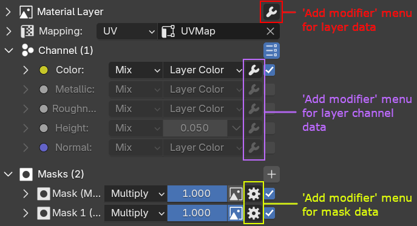
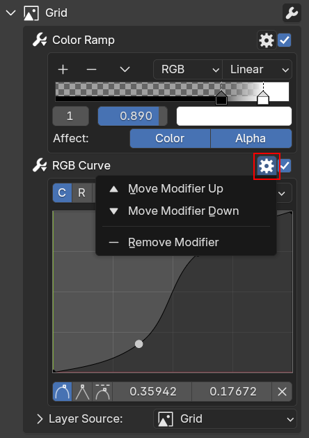

# Modifier

Modifiers are useful to add non destructive effects. You can apply modifiers to a layer, a mask, or the layer channel.

||
|:--:|
|Various `Add Modifier` menu locations| {align=center}

Keep in mind that not all modifier types are available for every item type. For example, there are only three modifiers available for masks (Invert, Ramp, and Curve).

||
|:--:|
|Adding modifier to a layer, a layer channel, and a mask| {align=center, width=100%}

## Modifier types

- **Invert**: will invert selected rgb and alpha values
- **RGB to Alpha**: will convert the rgb of your layer to intensity/alpha and replace layer rgb values themselves with a single color.
- **Alpha to RGB**: will convert the alpha of your layer to rgb and replace layer alpha value itself with a solid value
- **Color Ramp**: will map the layer rgb values to a color ramp
- **RGB Curve**: will tweak the rgb values using curve
- **Hue Saturation**: will tweak the rgb values using hue and saturation parameters
- **Brightness Contrast**: will tweak the rgb values using brightness and contrast parameters
- **Math**: will tweak the rgb and alpha values using math operations

## Modifier orders

Be aware if you have more than one modifier, modifier order will affects the result. The order is from bottom to top, so the top modifier will be executed last. You can edit modifier order using this menu.

||
|:--:|
|Menu for reordering modifier| {align=center}

## Adjustment Layer

If you create a new layer, there's an option to create an adjustment layer. Adjustment layer is actually uses a layer type called `Previous Layers` with modifier applied. Modifier applied to the `Previous Layers` layer will be applied to the all previous layers of the current layer and it will be applied to all channels selected on the layer.

||
|:--:|
| Adjustment Layer Demo| {align=center, width=100%}

## Transition Modifiers

Transition modifiers are special modifiers that applied to the layer alpha (including masks) gradient value. It applied on the layer channel but will also affect other channels.

### Transition Bump

Transition bump can be only added to a Height layer channel, it's to sharpen the alpha transition, very useful to create bump lines.

||
|:--:|
|Transition Bump Demo| {align=center, width=100%}

Options for transition bump are:

- **Max Height**: Height of the transition bump. Layer height's midlevel will become at the level of the transition bump max height.
- **Edge 1**: The sharpness of the outer edge of the alpha gradient
- **Edge 2**: The sharpness of the inner edge of the alpha gradient
- **Affected Masks**: Number of masks that transition bump will be applied
- **Flip**: Flip the transition bump height, this will produce different effect than just uses negative value of the max height
- **Crease**: Add crease at the outside of the transition bump effect (Can only be used if `Flip` is disabled)
- **Falloff**: Add falloff to the alpha gradient faloff.

On other channel than height, there will `Transition Factor` will appear to control the sharpness of the alpha transition of that specific channel.

### Transition Ramp

Transition ramp is for adding ramp modifier along the alpha gradient value. Transition ramp effect will be sharper if there is also transition bump enabled in the height channel.

||
|:--:|
|Transition Ramp Demo| {align=center, width=100%}

Options for transition ramp are:

- **Opacity**: Opacity of the transition ramp
- **Blend**: Blend type of the transition ramp

There's extra option in the gear button called `Unlink Ramp with Channel Intensity`, it's for unpair the channel opacity value with the transition ramp colors, so the layer channel can be transparent, but the transition ramp will still opaque.

### Transition AO

Transition AO is for adding fake ambient occlusion effect in area outside of transition bump. You need transition bump to be enabled on the height first to use Transition AO.

||
|:--:|
|Transition AO Demo| {align=center, width=100%}

Options for transition AO are:

- **Opacity**: Opacity of the transition AO
- **Blend**: Blend type of the transition AO
- **Power**: Strength of the AO
- **Color**: Color of the AO
- **Inside**: Will also add AO inside the inner part of the transition bump
