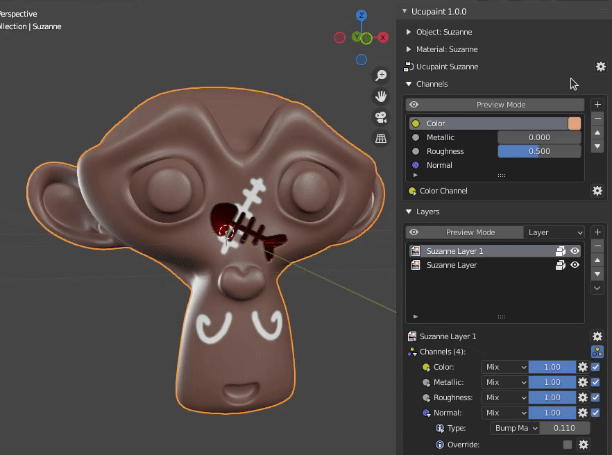

# Preview Mode

Preview Mode is used to isolate and directly view individual layers, layer alphas, final channel outputs, or specific mask/data without interference from scene lighting.

## Channel Preview Mode

The option `Channel` in preview mode will output the entire selected channel output of the channel

||
|:--:|
|Using channel preview mode| {align=center}

<!--  -->

## Layer Preview Mode

The option `Layer` in preview mode lets you see only a single layer that uses the selected channel. If the layer doesn't use the selected channel, it will show you a pink grid material.

||
|:--:|
|Using layer preview mode| {align=center}

<!--  -->

## Layer Alpha Preview Mode

The option `Layer Alpha` in preview mode is to see only the alpha value of the single layer that uses the selected channel.

||
|:--:|
|Using layer alpha preview mode| {align=center}

## Active Data/Mask Preview Mode

The option `Active Mask/Data` in preview mode is to see the selected active data/mask.

||
|:--:|
|Using active mask/data preview mode| {align=center}

