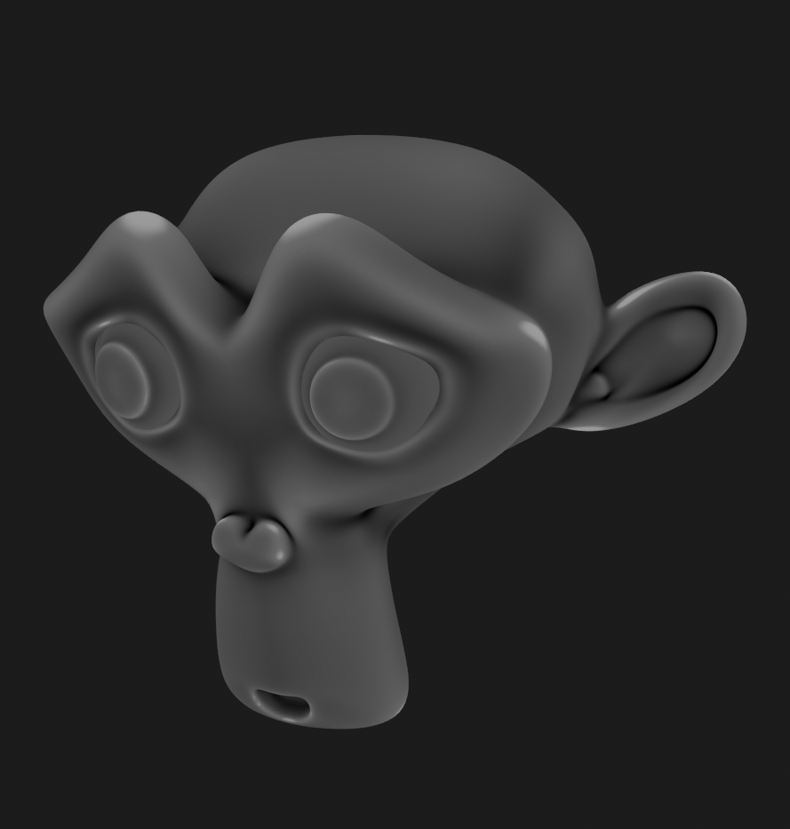
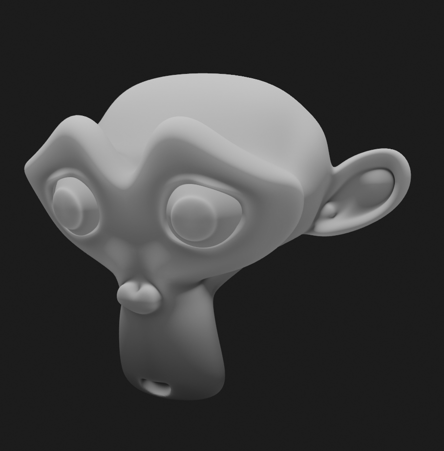
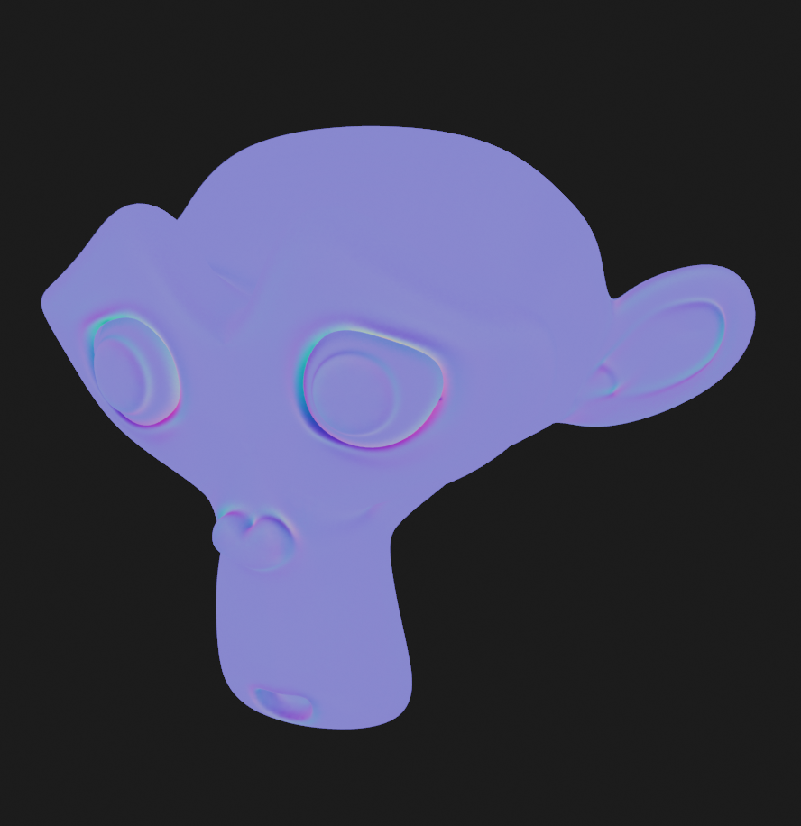

# Bake to Layer

When creating a new layer, there are options to bake textures to a layer. The bake process can take a while depending on your system. You can see how it works in the video below.

||
|:--:|
|Bake AO to layer| {align=center}

## Rebake Layer

After you edit the mesh or the scene, sometimes you want to rebake the layer, there are two ways to do it.

### Rebake using Overwrite

If you try to add ambient occlusion layer again, it will give you an option to overwrite the currently available ambient occlusion layer. It's turned on by default so be aware of that.

||
|:--:|
|Using Overwrite Option| {align=center}

### Rebake using rebake button

You can also use the rebake button in the layer source panel.

||
|:--:|
|Using Rebake Menu| {align=center}

## Baked Texture Types

There are several texture types that can be baked to a layer:

### AO

AO (Ambient Occlusion) can darken the valleys or creases of your mesh. You can use options such as distance and local only.

||
|:--:|
|AO| {align=center}

### Pointiness

Pointiness will highlight the valleys and ridges of your mesh. Since it need a lot of precision, by default, baking pointiness will use 32-bit float image as a target.

||
|:--:|
|Pointiness| {align=center}

### Cavity

Similar to pointiness, cavity will show valleys and ridges of your meshes but with clearer distinction, it also only use a standard 8bit image by default, so it won't take a lot of space.

||
|:--:|
|Cavity| {align=center}

### Dust

Dust is similar to the cavity map but adds additional Z top normals to the mix.

||
|:--:|
|Dust| {align=center}

### Paint Base

Sometimes also referred to as the Blizzard or Dota diffuse map. This bake combines a dirt map with vertical gradient and top facing normals with a highlight. Credits to Danyl Bekhoucha for the shader setup.
This bake is a good starting point for character texture maps.

||
|:--:|
|Paint Base| {align=center}

### Bevel Normal

Bevel normal map in tangent space. This will bake bevel on sharp edges.

||
|:--:|
|Bevel Normal| {align=center}

### Bevel Grayscale

Grayscale bevel of the mesh.

| |
|:--:|
|Bevel Grayscale| {align=center}

### Multires Normal

This will bake the highest level of multires to a normal map.

||
|:--:|
|Multiers Normal| {align=center}

### Multires Displacement

This will bake the highest level of multires to a displacement/bump map.

||
|:--:|
|Multiers Displacement| {align=center}

### Other Objects Normal

This will bake the surface normal of other non-active selected objects to a normal map.

||
|:--:|
|Other Objects Normal| {align=center}

### Other Objects Emission

This will bake the emission color of other non-active selected objects to a color map.

||
|:--:|
|Other Objects Emission| {align=center}

### Selected Vertices

This will bake the the selected vertices to white color while other vertices will be black. This can be useful for masking. In the video below, the monkey's eyes are baked as white, while the rest of the monkey is baked as black.

||
|:--:|
|Selected Vertices| {align=center}

