# Bake as Layer/Mask

When creating a new layer or mask, there are options to bake various data as an image layer.

|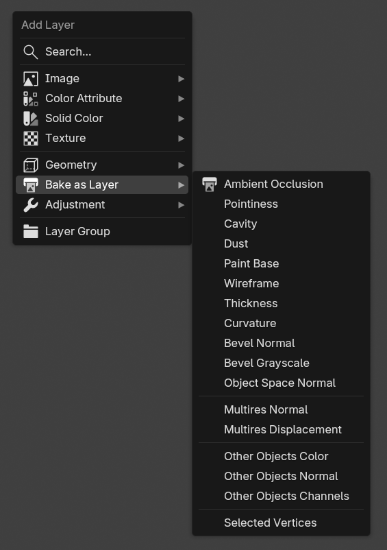|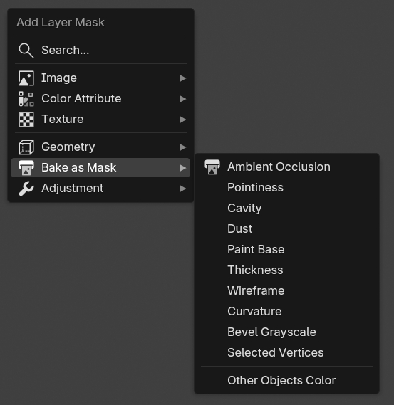|
|:--:|:--:|
| Bake as Layer Menu | Bake as Mask Menu|

The bake process can take a while depending on your system. You can see how it works in the video below.

||
|:--:|
|Bake Bevel Normal as an image layer| {align=center}

## Rebake

After you edit the mesh or the scene, sometimes you want to rebake the layer. The easiest way to do it is by pressing the `Rebake` button in the layer/mask source panel.

||
|:--:|
|Rebake using `Rebake` Button| {align=center}

Be aware if you already have already baked data (Bevel Normal for example) and you want to bake the same data type again, the default behavior is Ucupaint will overwrite the already baked data. To disable this, you can disable the `Overwrite` option at bake dialog box.

### Batch Rebake

If you already have multiple data baked, and want to edit the mesh or scene again, rather that pressing the `Rebake` button one by one for each baked images, you can just press `Rebake All Baked Images`, this will rebake all baked layers/masks in the Ucupaint node. The process can take a while depending on how many data you already baked.

||
|:--:|
|Rebake AO and Bevel Normal at the same time using `Rebake All Baked Images` Button| {align=center}
## Baked Texture Types

There are several texture types that can be baked to a layer:

### AO

AO (Ambient Occlusion) can darken the valleys or creases of your mesh. You can use options such as distance and local only.

|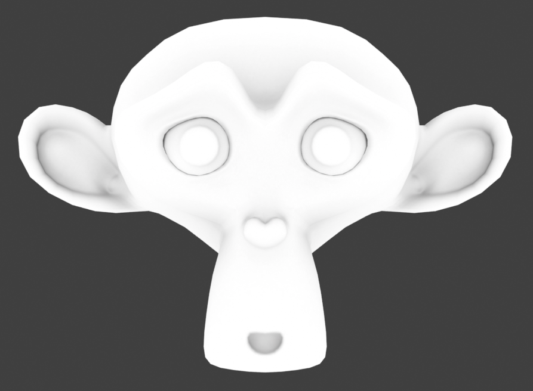|
|:--:|
|AO| {align=center}

### Pointiness

Pointiness will highlight the valleys and ridges of your mesh. Since it need a lot of precision, by default, baking pointiness will use 32-bit float image as a target.

|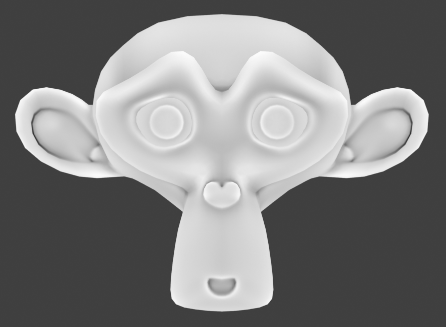|
|:--:|
|Pointiness| {align=center}

### Curvature

Curvature is similar to pointiness, but with stronger valleys and rigdes.

|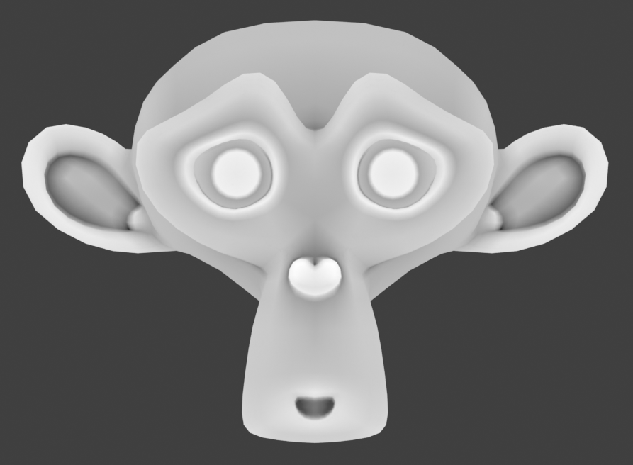|
|:--:|
|Curvature| {align=center}

### Cavity

Similar to pointiness, cavity will show valleys and ridges of your meshes but with clearer distinction, it also only use a standard 8bit image by default, so it won't take a lot of space.

|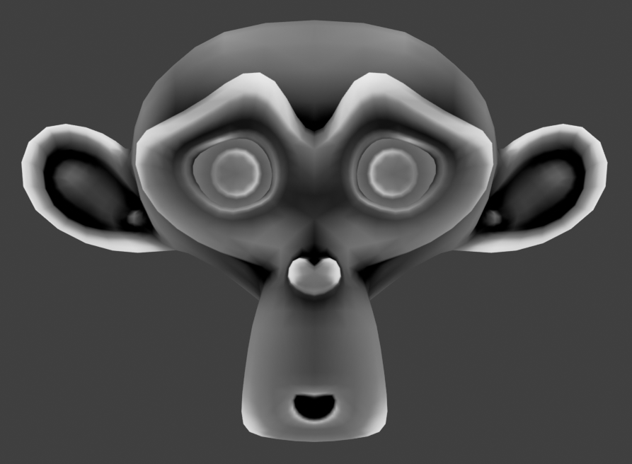|
|:--:|
|Cavity| {align=center}

### Dust

Dust is similar to the cavity map but adds additional Z top normals to the mix.

|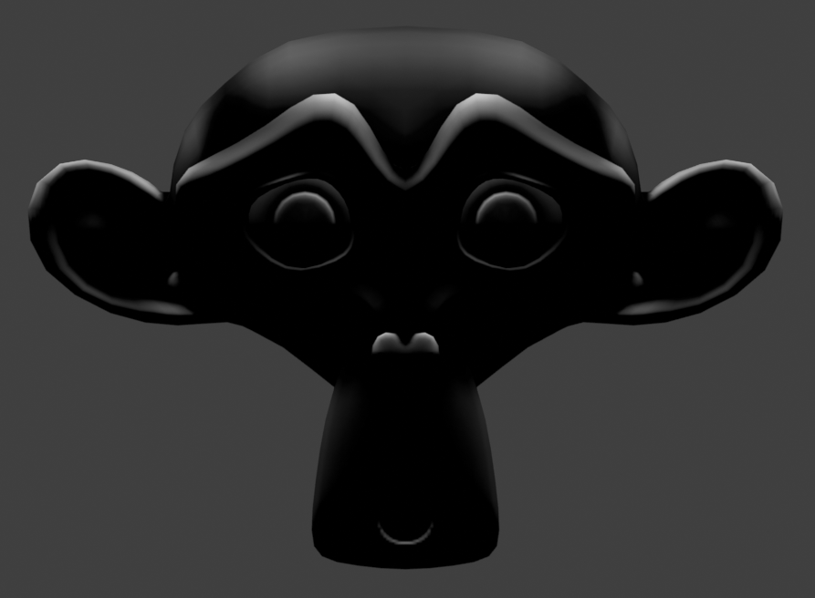|
|:--:|
|Dust| {align=center}

### Paint Base

Sometimes also referred to as the Blizzard or Dota diffuse map. This bake combines a dirt map with vertical gradient and top facing normals with a highlight. Credits to Danyl Bekhoucha for the shader setup.
This bake is a good starting point for character texture maps.

|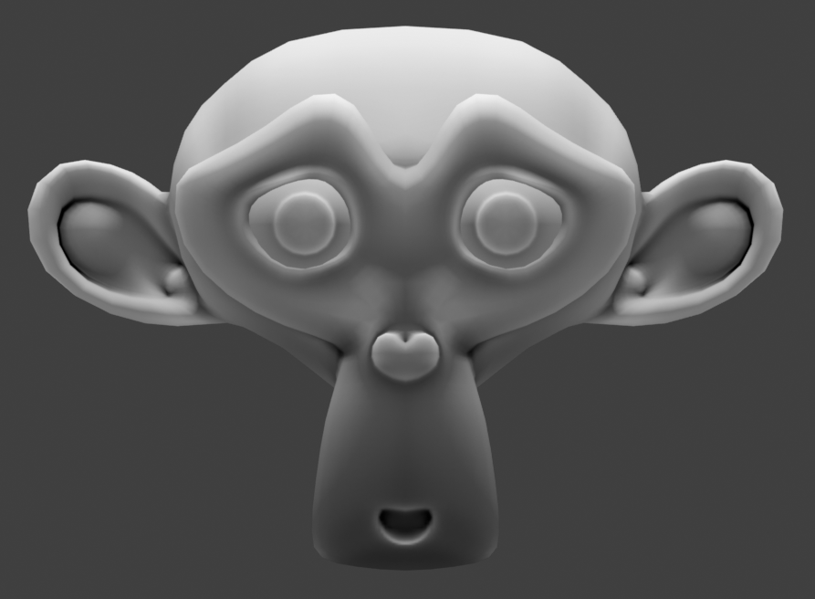|
|:--:|
|Paint Base| {align=center}

### Thickness

Thickness will bake the thickness of the mesh. Internally, it uses the inverted normal AO to achieve the thickness.

|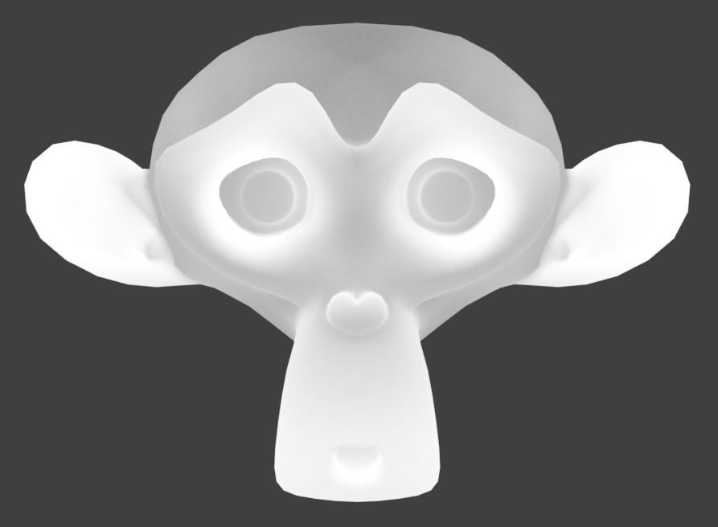|
|:--:|
|Thickness| {align=center}

### Wireframe

Wireframe will bake the wireframe of the mesh.

|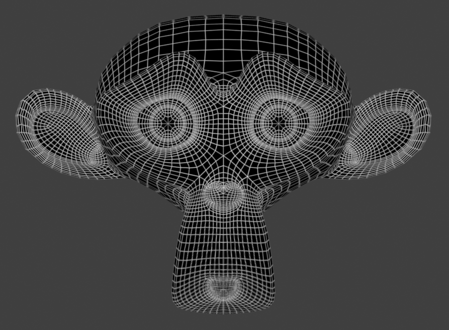|
|:--:|
|Wireframe| {align=center}

### Bevel Normal

Bevel normal map in tangent space. This will bake bevel on sharp edges.

|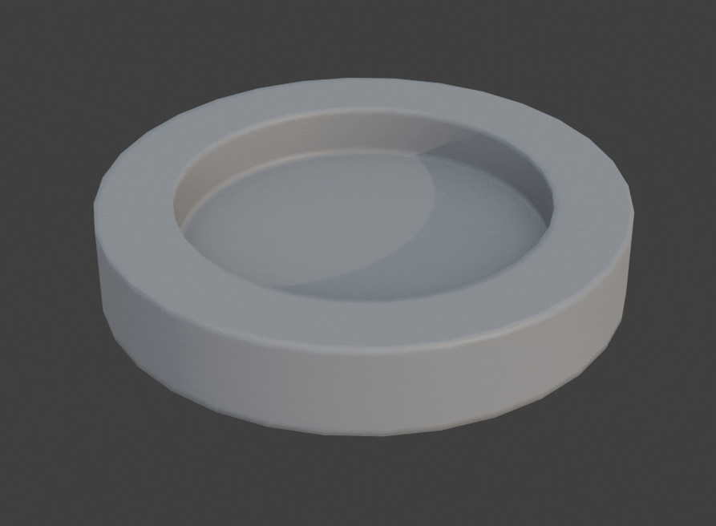|
|:--:|
|Bevel Normal| {align=center}

### Bevel Grayscale

Grayscale bevel of the mesh.

|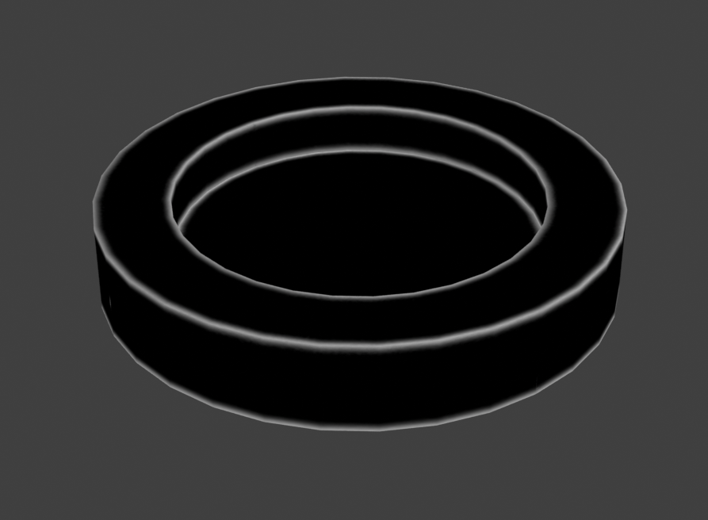 |
|:--:|
|Bevel Grayscale| {align=center}

### Multires Normal

This will bake the highest level of multires to a normal map.

||
|:--:|
|Multiers Normal| {align=center}

### Multires Displacement

This will bake the highest level of multires to a displacement/bump map.

||
|:--:|
|Multiers Displacement| {align=center}

### Other Objects Normal

This will bake the surface normal of other non-active selected objects to a normal map.

||
|:--:|
|Other Objects Normal| {align=center}

### Other Objects Emission

This will bake the emission color of other non-active selected objects to a color map.

||
|:--:|
|Other Objects Emission| {align=center}

### Selected Vertices

This will bake the the selected vertices to white color while other vertices will be black. This can be useful for masking. In the video below, the monkey's eyes are baked as white, while the rest of the monkey is baked as black.

||
|:--:|
|Selected Vertices| {align=center}

