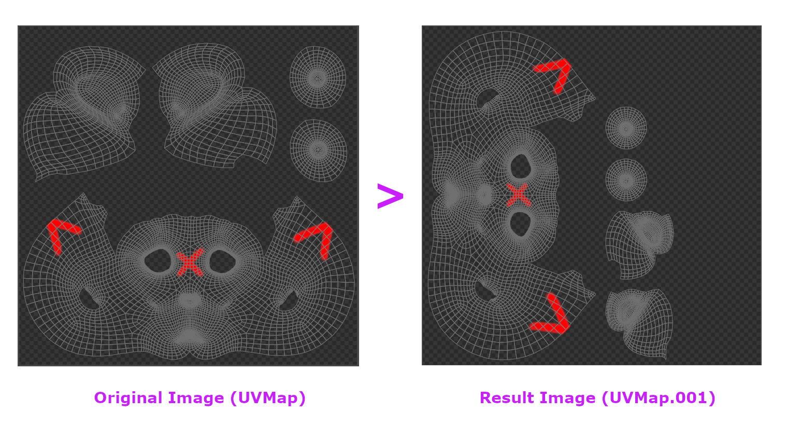

# TRANSFER UV

Transfer UV can be useful when you need to transfer image from one UV map to another UV map. This can be useful if your original UV map wasn't very good and you already created the better one. 

For the demo, we have two UV map named 'UVMap' and 'UVMap.001'. We will try to transfer an image using UVMap to UVMap.001

||
|:--:|
|UVMap & UVMap.001 has different layout and we want to transfer image from one to another| {align=center}

||
|:--:|
|Tranfer Process| {align=center}

Transfer process can take a while since it uses blender baking system and the image result will be automatically used on your mask or layer.

||
|:--:|
|Result image compared to the original| {align=center}

