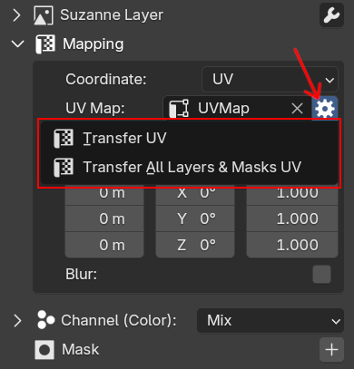
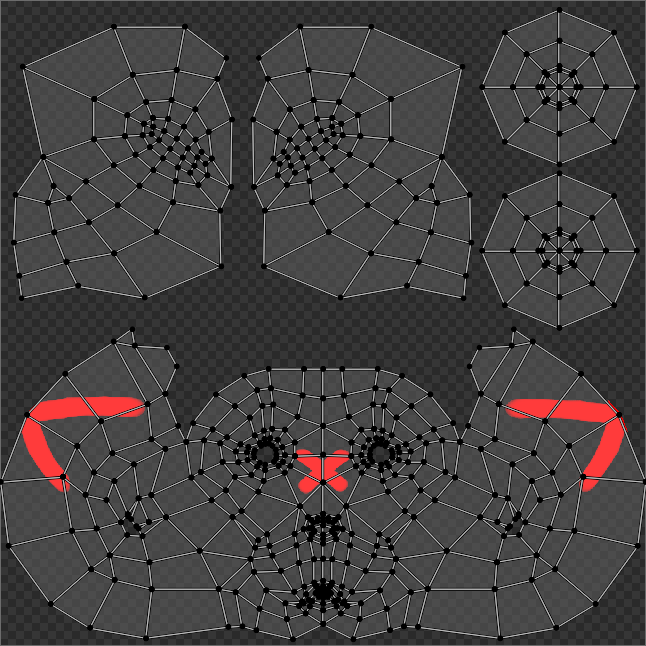
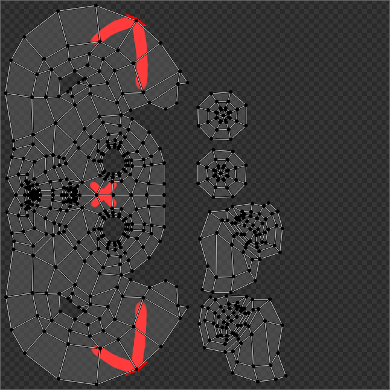

# Transfer UV

Transfer UV can be useful when you need to transfer image from one UV map to another UV map. This can be useful if your original UV map wasn't very good and you already created the better one.  The transfer process can take a while since it uses Blender's baking system.

Transfer UV is accesible beside the UV Map section in the expanded mapping panel.

||
|:--:|
| Transfer UV menu | {align=center}

There's two operators that you can choose, `Transfer UV` will only transfer the current image layer/mask, while the `Transfer All Layers & Masks UV` will transfer all image layers/masks that use the same UV.

The `Transfer UV` operator options are:

- **From UV**: Only available for `Transfer All Layers & Masks UV`. All image layers and masks that use this UV will be transferred to new UV.
- **Target UV** / **To UV**: The target UV that the image will be transferred into.
- **Samples**: Sample for the transferred image, the default is using one sample, it's generally fine, but try to increase it if the bake result has jagged lines or noises.
- **Margin**: Number of spereaded color pixels along the edge of UV islands to hide the UV seams, please increase it if the seam of your model look visible in far distance.
- **Delete From UV**: Only available for `Transfer All Layers & Masks UV`. Selected UV on `From UV` will be deleted will be deleted after the transfer process is done. Useful if you don't want to use the original UV anymore.

# Demo

For the example, we can transfer an image from the original UV (_UVMap_) where the image is painted to other UV (_UVMap.001_).

||
|:--:|
|Transfer UV Demo| {align=center}

|||
|:--:|:--:|
| Original Image is using _UVMap_ | `Transfer UV` Result on _UVMap.001_ |

