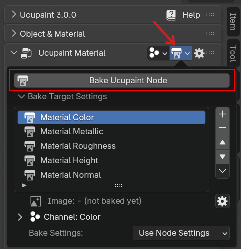
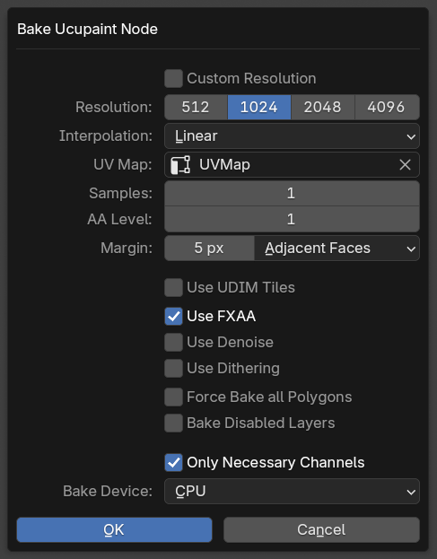
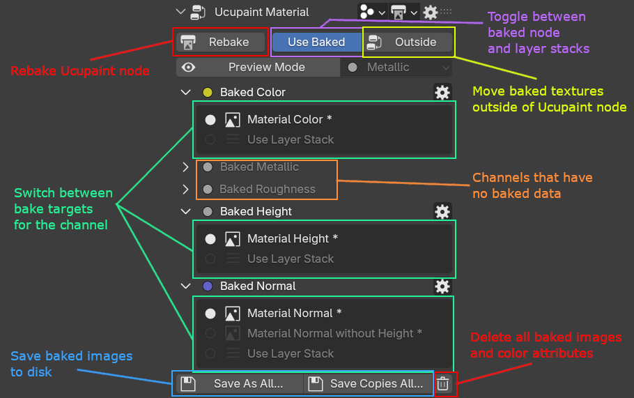
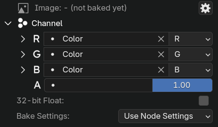
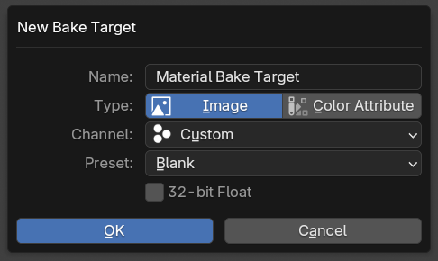

# Baking Ucupaint Node
<!-- ## Bake Ucupaint Node -->

Ucupaint node can be baked into images or color attributes, it's very useful if you want to export for another software. To bake ucupaint node, you can click on bake target popover button and click `Bake Ucupaint Node`.

||
|:--:|
|`Bake Ucupaint Node` button| {align=center}

Press `Bake Ucupaint Node` will show up bake settings of the node

||
|:--:|
|`Bake Ucupaint Node` dialog box | {align=center}

The dialog box options for baking ucupaint node will be applied for all bake targets that uses the node settings. It can be individually set to custom settings if needed in the bake target settings. The settings for baking ucupaint node are:

- **Resolution**: Resolution of the baked image.
- **Interpolation**: Pixel filtering interpolation of the baked image. The default is linear, but use `Closest` for pixel art
- **Samples**: Sample for the baked image, the default is using one sample, it's generally fine, but try to increase it if the bake result has jagged lines or noises.
- **AA Level**: Supersample anti aliasing level, you can only choose between 1 or 2. One is not using super sample antialiasing, and two (2) will quadruple the bake image size and it will automatically resized back to selected resolution, this can gives good antialiasing in some cases, but very heavy on memory as it can cause crash if you run out of memory.
- **Margin**: Number of spereaded color pixels along the edge of UV islands to hide the UV seams, please increase it if the seam of your model look visible in far distance.
- **Use UDIM Tiles**: Use UDIM for the baked image. This will enabled automatically if there's UV islands outside 0.0-1.0 range (can be disabled in addon preferences)
- **Use FXAA**: Use FXAA antialiasing method as an alternative to the supersample one, it's very lightweight but can add slight blur in some texture details.
- **Use Denoise**: Use blender denoising to the bake result, can reduce noise if you use realtime AO layer/mask
- **Use Dithering**: Use blender dithering to the bake result, can reduce banding if you use gradient layer/mask.
- **Force Bake All Polygons**: This will bake all polygons even if the polygons don't use the active material. Useful if your material is a secondary material for solidify modifier for example.
- **Bake Disabled Layers**: This will make all disabled layers enabled while baking the node.
- **Only Necessary Channels**: This will only bake channels that has at least one layer using (Base Layer is not counted, unless it's connected with external node)
- **Bake Device**: Choose between CPU, GPU, or CPU (OSL) for the baking device. The GPU is usually faster but it can hang the first time you done it for shader compilation. The OSL is useful to bake the most complex layer/shader setup if CPU an GPU fails to bake.

After baking the UI will switch to `Use Baked` UI, this will show you all the baked bake targets.

||
|:--:|
|  Explanations for `Use Baked` UI  | {align=center}

You can toggle between `Use Baked` state of the node and the layered ones. 

||
|:--:|
| Baking Ucupaint node demo | {align=center}

The button labeled `Outside` beside the `Use Baked` is for moving all baked nodes to outside the ucupaint node, this is useful for exporting the models with GLTF or FBX, which need the textures to be directly connected to the Principled BSDF.

||
|:--:|
| `Use Baked Outside` will make the baked nodes outside of Ucupaint node | {align=center}

## Bake Target

Bake target is the setting for the image or color attribute that will be used for baking the ucupaint node. A channel need a bake target to be able to be baked when you bake the ucupaint node. By default when channel is created, it always also create a bake target for it.

Bake target can be an image or color attribute.

### Bake target settings

||
|:--:|
| Bake target settings | {align=center}

The settings for each bake target are:

- **Channel**: You can set the `R`, `G`, `B`, and `A` of the image channel refer which channel of Ucupaint.
- **32-bit Float**: More precision to image created, this option is only available for image bake target.
- **Bake Settings**: Bake settings like resolution, interpolation, etc. The default will use `Use Node Settings`, which mean it will use the setting that is shown when you do `Bake Ucupaint Node`.

If some special channel types are used for the bake target, there are extra bake target options:

- **Normalize Height**: Only available for height channel, if enabled, the bake result will fit into 0.0-1.0 range.
- **Normal includes Height**: Only available for normal channel, if enabled, the height bump will be included into the normal map.

### Create new bake target

To create new bake target, press the `+` button beside the bake target list.

||
|:--:|
| New bake target dialog box | {align=center}

The options for creating new bake target are:

- **Type**: Choose between image or color attribute bake target
- **Channel**: Channel that will be used for the bake target. Use `Custom` to manually set the individual `R`, `G`, `B`, and `A` image/attribute channel of the bake target
- **Preset**: Only available when `Custom` channel is selected, the only options available for preset right now is ORM and DirectX Normal.
- **32-bit Float**: More precision to image created, this option is only available for image bake target.

||
|:--:|
| Example of creating color attribute bake target and baking it | {align=center}

<!--

Channel Baking the layer is important if your model will be used in other software. That's because other software can't read Blender's node shaders.
Baking channels with Ucupaint is easy, you can go to the Ucupaint special menu. It can be found on the gear icon under the Material Panel. Just click bake all channels and set the right configuration. The baking process then begins.

||
|:--:|
|Bake All Channels| {align=center}

 

The baked textures are automatically packed if you save the blend file, but you can also save them to a directory of your choice, as demonstrated in the video below.

||
|:--:|
|Save All Baked Textures| {align=center}

The Baking process is a non-destructive workflow, you can still go back and edit your texture layer by layer using this toggle button.

||
|:--:|
|Toggle between using baked textures or not| {align=center}

-->
