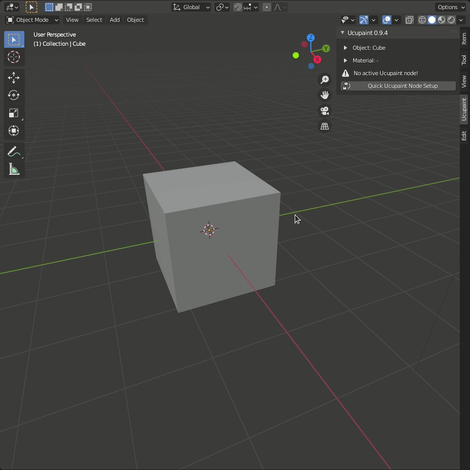

# Starting Guide

For the quick setup, we just need to click `Quick PAINTERy Node Setup` >> select the channels that we need >> and we're ready to go.

For example we can create several layers and start painting.

