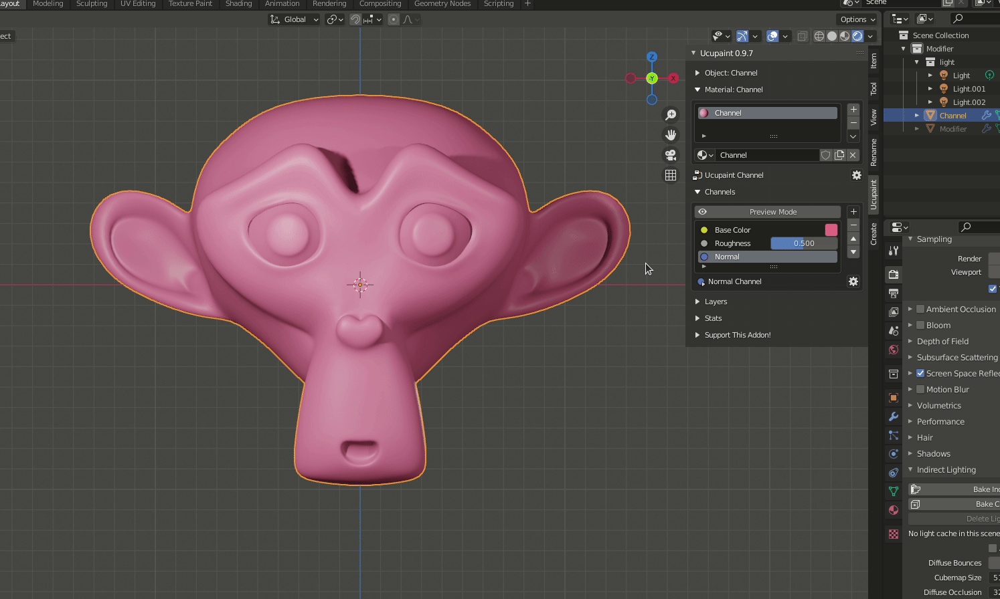

# Channel Operation

## Add

Used to add new channel to the material. when we add the new channel we need to choose the [channel type](02.02.channel-type.md) and the channel connection destination.

## Remove

Used to remove or delete the channel on the material.

## Move

We can move the channel on the material. moving the channel just ordering the channel on the material and not affect to the output of material.

## Preview

Used to preview the selected channel only.