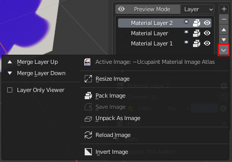
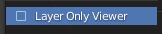

# Layer Operation

## Create

We can create layer using the   button with different [layer type](/03.layers/#layer_type). In this case we create new image layer.

## Move

Moving selected layer, can be done using the  button.  for moving up the layer, and  to bring the layer down.

## Delete

 button can be used for deleting selected layer.

## Advance Layer Operation

We have some advance layer operation, most of the operation is work just for image layer type. So don't be suprised if the operation might be disabled in some layer type.

Some of operation can be found in layer special menu.

### Merge Layer

Using merge layer, we can merge selected layer with the upper or lower layer. In this current version, merge layer operation have some limitation :

1. Merge layer is only work in image layer type
2. Merge layer is only support to merge one layer channel. So if you have different texture in each layer channels, only the selected layer channel will be merged.

### Layer Only Viewer

Layer Only Viewer is preview of the active layer only, there are two ways to do this operation. 

1. using the  button on the top of layer list.
2. using the  check box in layer special menu .

### Resize Image

Resize Image operation can be usefull for resizing your texture.

### Pack Image

Pack Image operation is doing [Blender Pack Data](https://docs.blender.org/manual/en/latest/files/blend/packed_data.html#pack-data).

### Save Image

Saving your edited image texture.

### Unpack As Image

Unpack Image Operation is doing [Blender Unpack Data](https://docs.blender.org/manual/en/latest/files/blend/packed_data.html#unpack-data).

### Reload Image

We can reload the image texture, meant for reloading the image texture if we make changes outside Blender.

### Invert Image

-