# Layer Type

## Image

### New Image

Creating New image layer for texturing.
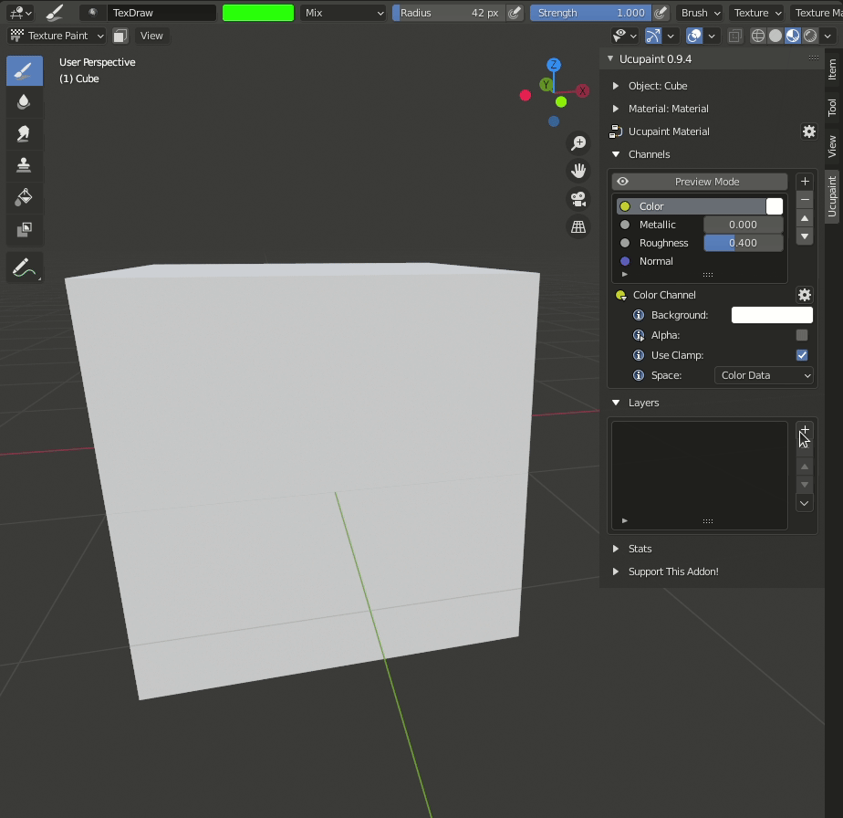

There is an option when creating new image layer :
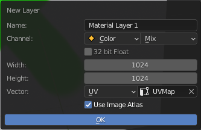

**Options** :

- Name : Layer Name.
- Channel : Choose the layer channel, and blend type.
- 32 bit Float : With this option, we can create 32 bit image texture.(the default is 8 bit)
- Width : Width image size.
- Height : Height image size.
- Vector : Choose the texture coordinate type and UVMap (for UV coordinate type).

### Open Image

Open image layer from file.

### Open Availabe Image

Select available image in Blender.

There is an option when creating new image layer :

**Options** :

- Image : Select availabel image.
- Vector : Choose the texture coordinate type and UVMap (for UV coordinate type).
- Channel : Choose the layer channel, and blend type.

### Open Images to Single Layer

We can also import the PBR texture using this layer type. we just need to select all PBR texture.

Normal information is using displacement texture as priority and fall back to normal map if displacement texture is not found.

## Group

Group is the layer type that will allow you to grouping your layers. Group layer is working like a folder, you can move your layer in and out with [move](/03.layers/#move) operation.

## Vertex Color

### New Vertex Color

### Open Available Vertex Color

## Solid Color

Solid Color give the layer a solid color value.
This layer have an option, Refer to the option of the layer, we have some solid color quick setup :

### Solid Color

Basic Solid Color layer
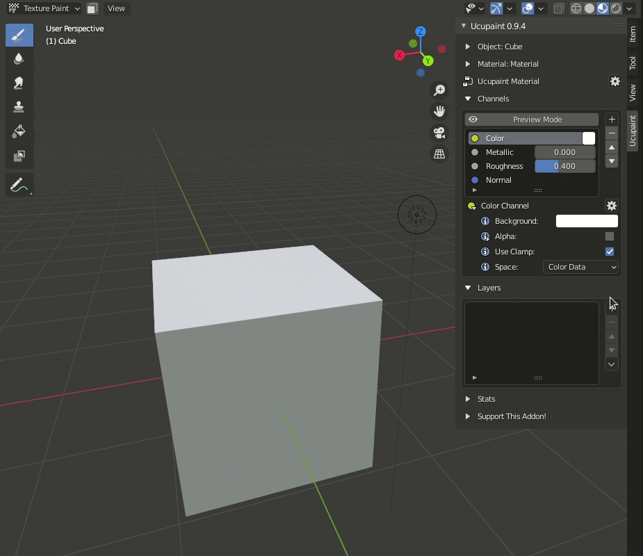

Basic options :

**Options** :

- Name : Layer name.
- Channel : Choose the layer channel, and blend type.
- Color : Color Selection.
- Add Mask : Enable disable [mask]() (Image mask, Color Mask)

### Solid Color with Image Mask

Solid Color With Image [mask]() 

Image Mask Options :
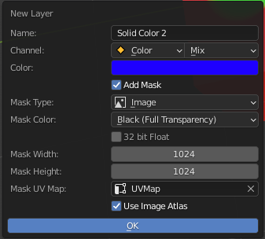

**Options** :

- Name : Layer name.
- Channel : Choose the layer channel, and blend type.
- Color : Color Selection.
- Mask Type : type of layer mask.
- Mask Color : Black for full transparency and white for full opacity
- 32 bit Float : With this option, we can create 32 bit image texture.(the default is 8 bit)
- Mask Width : Width image size.
- Mask Height : Height image size.
- Mask UV Map : Choose UVMap.

### Solid Color with Vertex Color Mask

Solid Color With Vertex Color [mask]()

Vertex Color Mask Options :

**Options** :

- Name : Layer name.
- Channel : Choose the layer channel, and blend type.
- Color : Color Selection.
- Mask Type : type of layer mask.
- Mask Color : Black for full transparency and white for full opacity

## Background

Background image is bring [Background Color]() from [Channel]() to the layer. this layer have an option and we have some quick setup based on the layer option :

### Background with Image Mask

Background layer with image [mask]()
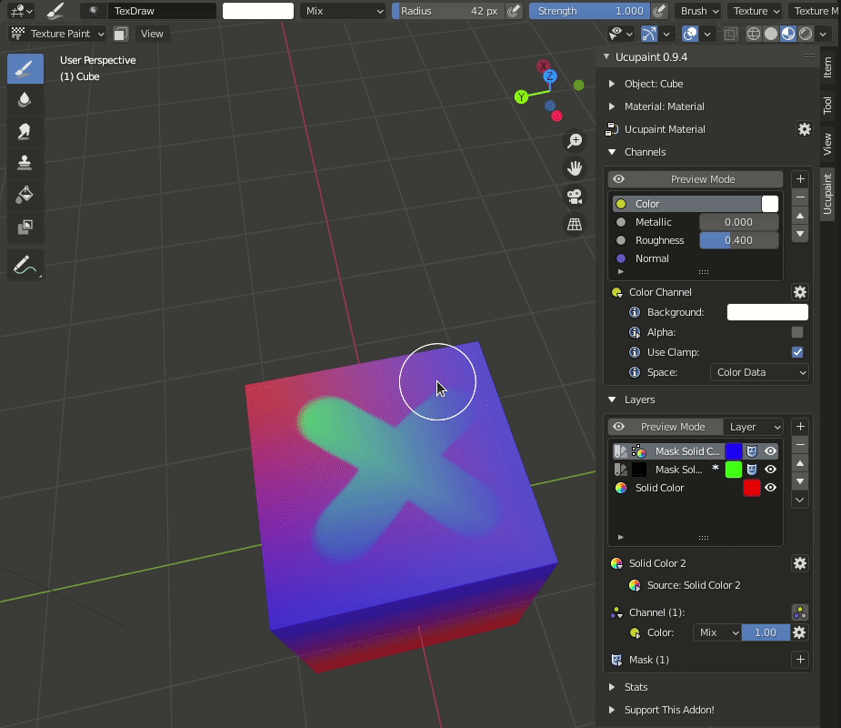

Image Mask Options :
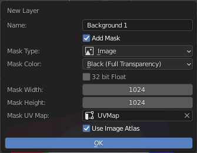

**Options** :

- Name : Layer name.
- Add Mask : Enable/Disable mask
- Mask Type : type of layer mask.
- Mask Color : Black for full transparency and white for full opacity
- 32 bit Float : With this option, we can create 32 bit image texture.(the default is 8 bit)
- Mask Width : Width image size.
- Mask Height : Height image size.
- Mask UV Map : Choose UVMap.

### Background with Vertex Color Mask

Background layer with vertex color [mask]()
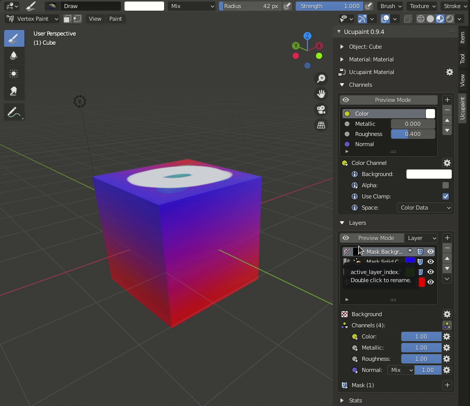

Vertex Color Mask Options :

**Options** :

- Name : Layer name.
- Add Mask : Enable/Disable mask
- Mask Type : type of layer mask.
- Mask Color : Black for full transparency and white for full opacity

## Generated

Generated layer type is basically a generated [texture](https://docs.blender.org/manual/en/latest/render/shader_nodes/textures/index.html) node from blender.

This is the list of generated layer type in Ucupaint:

1. [Brick](https://docs.blender.org/manual/en/latest/render/shader_nodes/textures/brick.html)
2. [Checker](https://docs.blender.org/manual/en/latest/render/shader_nodes/textures/checker.html)
3. [Gradient](https://docs.blender.org/manual/en/latest/render/shader_nodes/textures/gradient.html)
4. [Magic](https://docs.blender.org/manual/en/latest/render/shader_nodes/textures/magic.html)
5. [Musgrave](https://docs.blender.org/manual/en/latest/render/shader_nodes/textures/musgrave.html)
6. [Noise](https://docs.blender.org/manual/en/latest/render/shader_nodes/textures/noise.html)
7. [Voronoi](https://docs.blender.org/manual/en/latest/render/shader_nodes/textures/voronoi.html)
8. [Wave](https://docs.blender.org/manual/en/latest/render/shader_nodes/textures/wave.html)

## Fake Lighting

Fake lighting give fake light source to our model. 

## Bake (Bake something as layer)

With baking tool, we can convert some information from the model to image layer. so that we can make use of the information lighter and easier to customize.

The bake tool have some options. but now we will knowing about the global option. the global option is availabe on all type of bake layer :
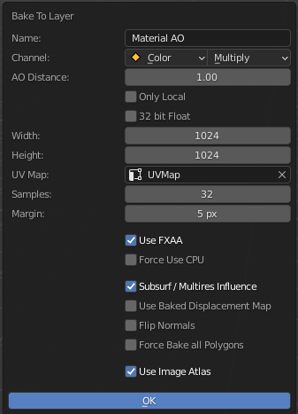

Options :

- Name : Layer name.
- Channel : Choose the layer channel, and blend type.
- 32 bit Float : With this option, we can create 32 bit image.
- Width : Width image size.
- Height : Height image size.
- UV Map : Choose UVMap.
- Samples : Control sampling of the baked image.
- Margin : Baked texture margin from UVMap.
- Use FXAA : Use Anti Aliasing effect.
- Force Use CPU : Force CPU for the main baking processor.
- Subsurf/Multires Influence : Control the baked image is affected by subsurf and multires or not.
- Use Baked Displacement Map : Control the baked image is affected by Baked Displacement map or not.
- Flip Normals : Flip the normal of the object.
- Force Bake all Polygons : useful if material is not using  direct polygon.
- Use Image Atlas : Use [Ucupaint Image Atlas]()

### Ambient Occlusion (AO)

This is the Bake AO result with the default options.

AO Options :
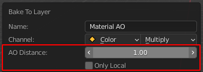

- AO Distance : Distance of object that contribute to ambient occlusion effect.
- Only Local : Only bake selected object.

### Pointiness

Bake Pointiness result.

This bake layer type is not have any special options.

### Cavity

Bake Cavity result.
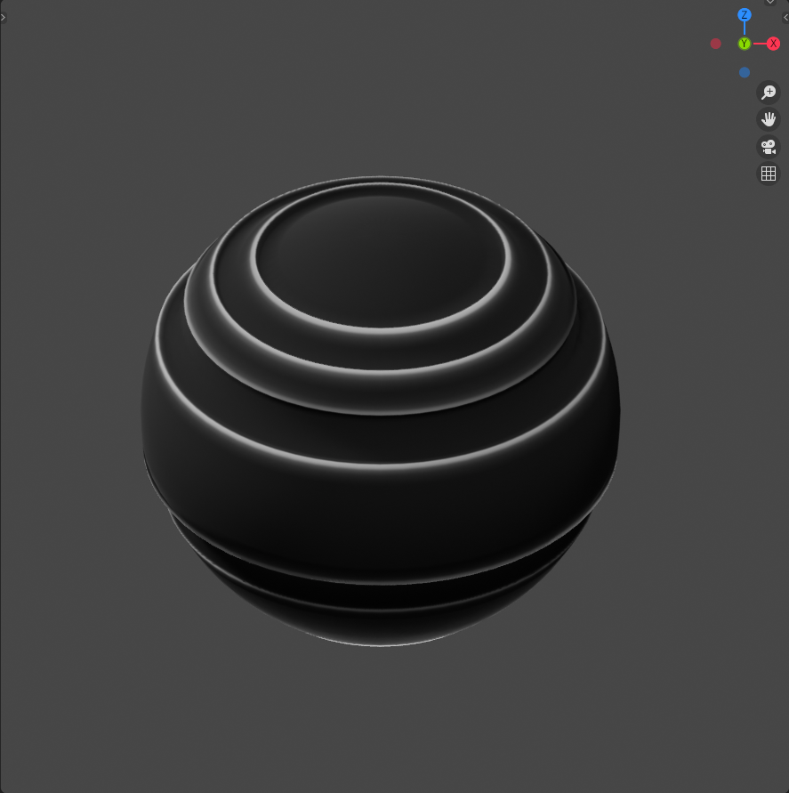

This bake layer type is not have any special options.

### Dust

Bake dust result.
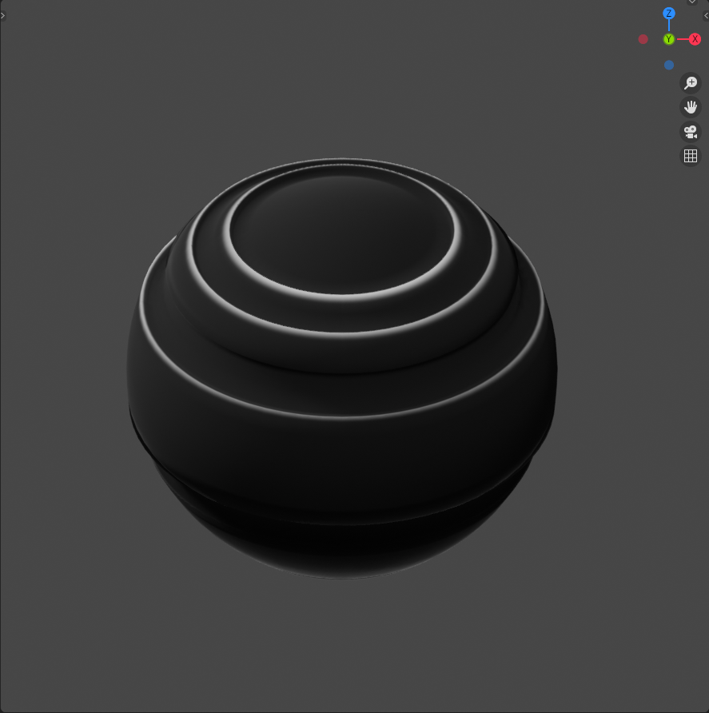

This bake layer type is not have any special options.

### Paint Base

Bake Paint Base Result.
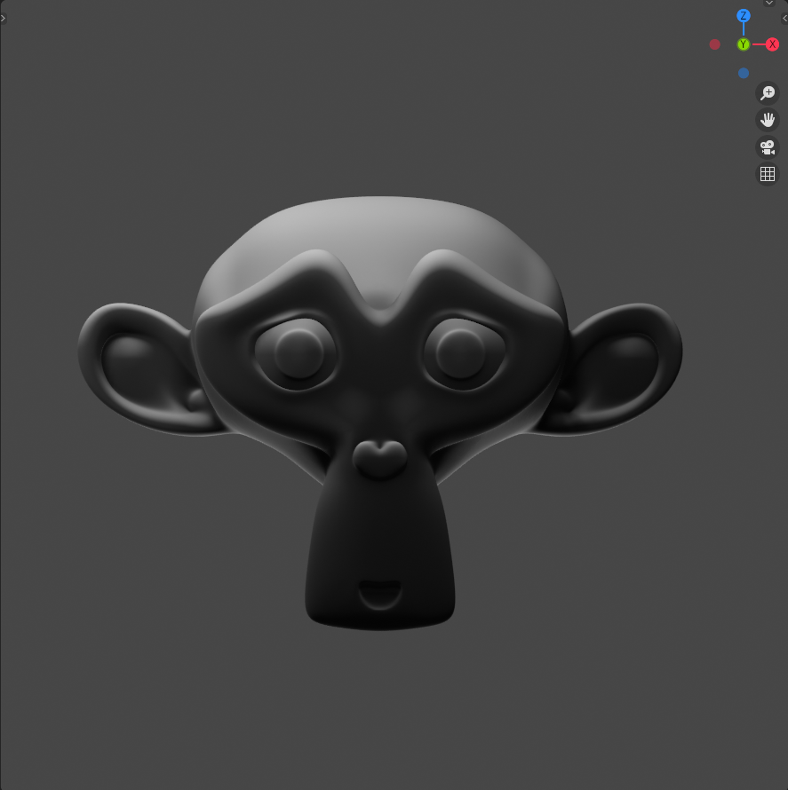

This bake layer type is not have any special options.

### Bevel Normal

Bake Bevel Normal result with default options.

Bevel Normal Options :
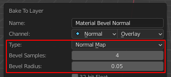

- Type : The available type is bump and normal.
- Bevel Samples : Control bevel samples.
- Bevel Radius : Control bevel radius.

### Bevel Grayscale

Bake Bevel Grayscale result with default options.

Bevel Grayscale Options :

- Type : The available type is bump and normal.
- Bevel Samples : Control bevel samples.
- Bevel Radius : Control bevel radius.

### Multires Normal

Bake Multires Normal result with default options.

Bake Multires Normal Options :
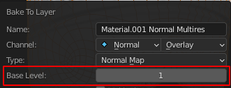

- Base Level : Base Level of the multires modifier which will bi baked.

### Multires Displacement

Bake Multires Displacement result with default options.

Bake Multires Normal Options :
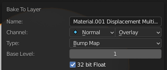

- Base Level : Base Level of the multires modifier which will bi baked.

This layer type is enabled the 32 bit float options in the default options for bring a good result.

### Other Object Emission

Using this layer type, we can bake other object emission effect as a texture layer for the main object.

Bake Multires Options :

- Cage Extusion : Inflate the active object by the specified distance for baking.
- Max Ray Distance : The maximum ray distance for matching points between the active and selected objects.
- *Use SSAA : Super sample Anti Aliasing. this is the super sample version of FXAA.0

### Other Object Normal

Using this layer bake type, we can bake other object as a normal texture layer.
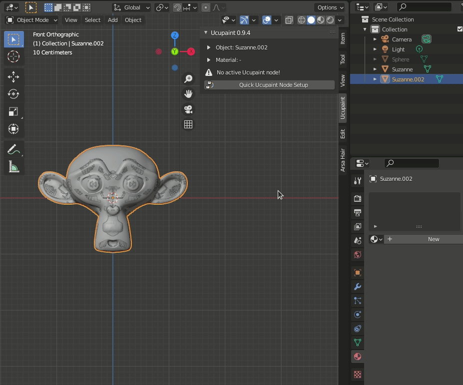

Bake Multires Options :
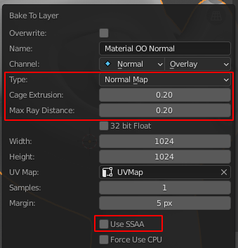

- Type : Information type ["Normal", "Bump"]
- Cage Extusion : Inflate the active object by the specified distance for baking.
- Max Ray Distance : The maximum ray distance for matching points between the active and selected objects.
- *Use SSAA : Super sample Anti Aliasing. this is the super sample version of FXAA.0

### Selected Vertices

We can create a black and white texture based on the selected vertices, face, or edge.

This bake layer type is not have any special options.