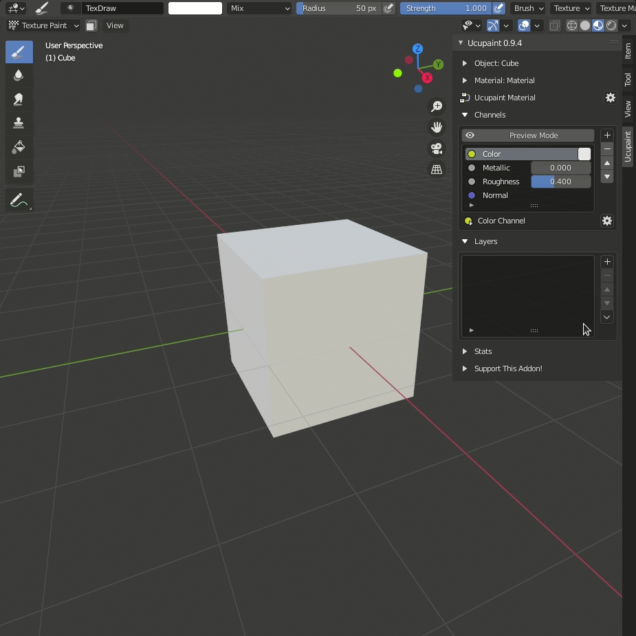
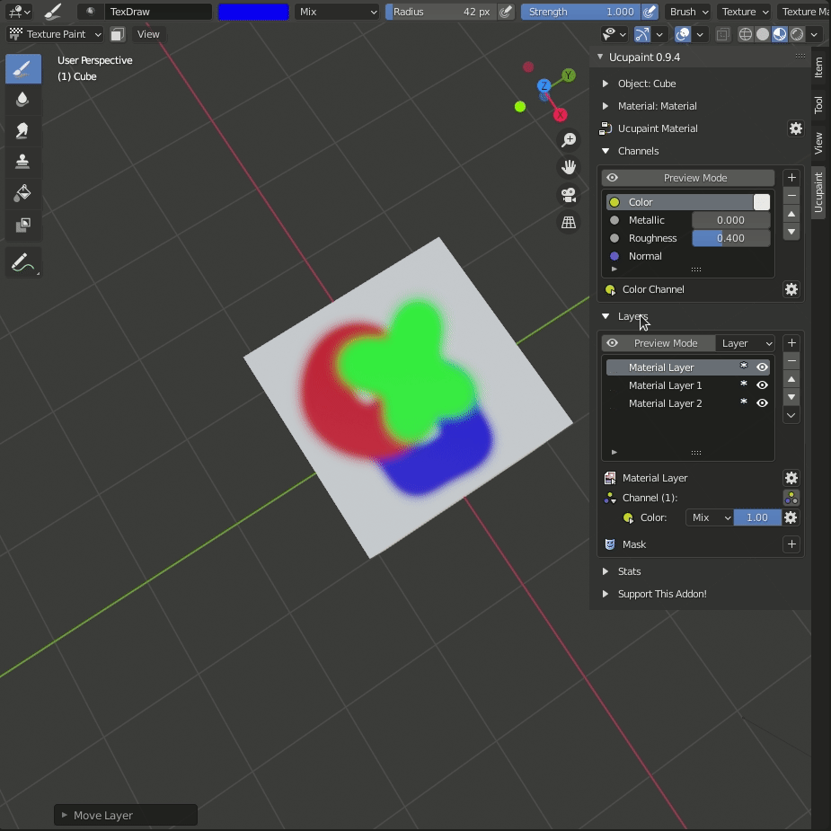

# Ucupaint Layers

Ucupaint layer system is similar to other programs layer systems. We can do many operation to the layers.

## Layer Operation

### Create

We can create layer using the   button with different [layer type](/03.layers/#layer_type). In this case we create new image layer.

### Move

Moving selected layer, can be done using the  button.  for moving up the layer, and  to bring the layer down.

### Delete

 button can be used for deleting selected layer.

### Advance Layer Operation

---

## Layer Type

### Image

#### New Image

Creating New image layer for texturing.

#### Open Image

Open image layer from file.

#### Open Availabe Image

Select available image in Blender.

#### Open Images to Single Layer

We can import the PBR texture using this layer type. we just need to select all PBR texture.

### Group

Group is the layer type that will allow you to grouping your layers. Group layer is working like a folder, you can move your layer in and out with [move](/03.layers/#move) operation.

### Vertex Color

#### New Vertex Color

#### Open Available Vertex Color

### Solid Color

#### Solid Color

#### Solid Color with Image Mask

#### Solid Color with Color Mask

### Background

#### Background with Image Mask

#### Background with Vertex Color

### Generated

Generated layer type is basically a generated [texture](https://docs.blender.org/manual/en/latest/render/shader_nodes/textures/index.html) node from blender.

This is the list of generated layer type in Ucupaint:

1. [Brick](https://docs.blender.org/manual/en/latest/render/shader_nodes/textures/brick.html)
2. [Checker](https://docs.blender.org/manual/en/latest/render/shader_nodes/textures/checker.html)
3. [Gradient](https://docs.blender.org/manual/en/latest/render/shader_nodes/textures/gradient.html)
4. [Magic](https://docs.blender.org/manual/en/latest/render/shader_nodes/textures/magic.html)
5. [Musgrave](https://docs.blender.org/manual/en/latest/render/shader_nodes/textures/musgrave.html)
6. [Noise](https://docs.blender.org/manual/en/latest/render/shader_nodes/textures/noise.html)
7. [Voronoi](https://docs.blender.org/manual/en/latest/render/shader_nodes/textures/voronoi.html)
8. [Wave](https://docs.blender.org/manual/en/latest/render/shader_nodes/textures/wave.html)

#### Wave

### Fake Lighting

### Bake (Bake something as layer)

## Duplicate Layer