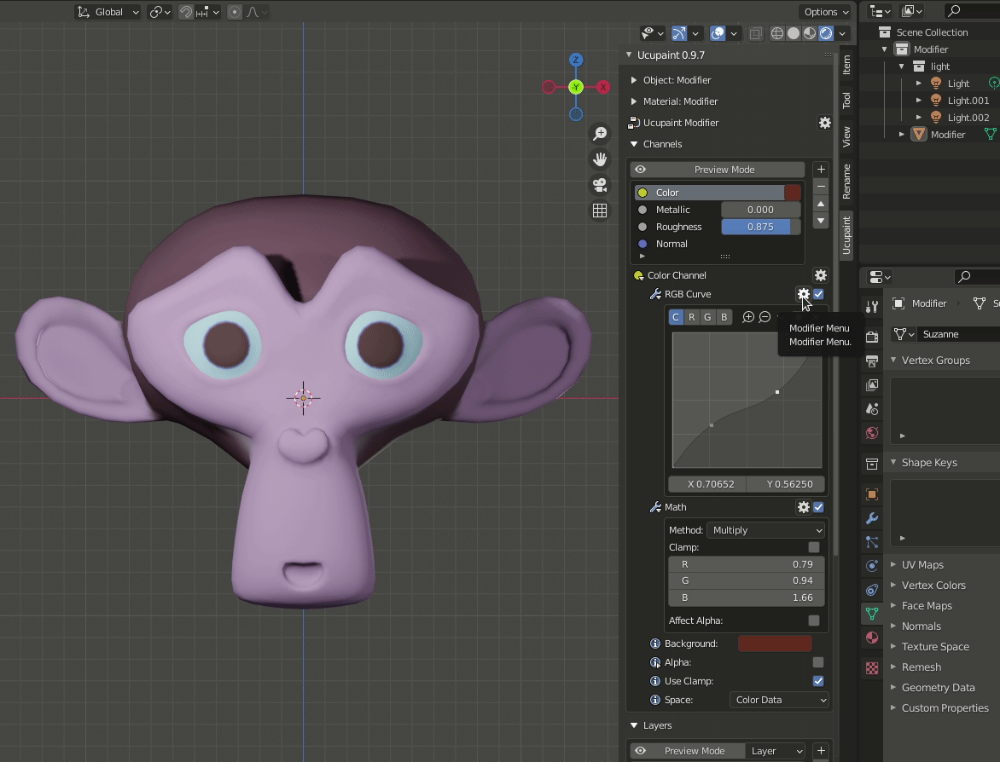
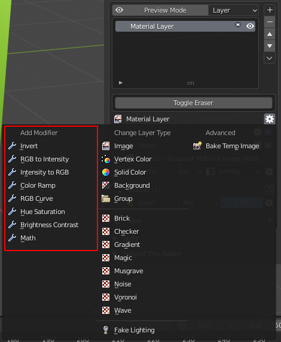
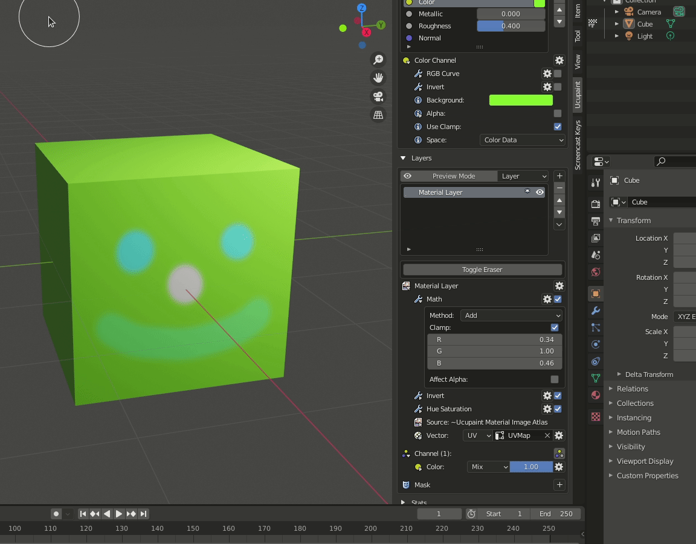
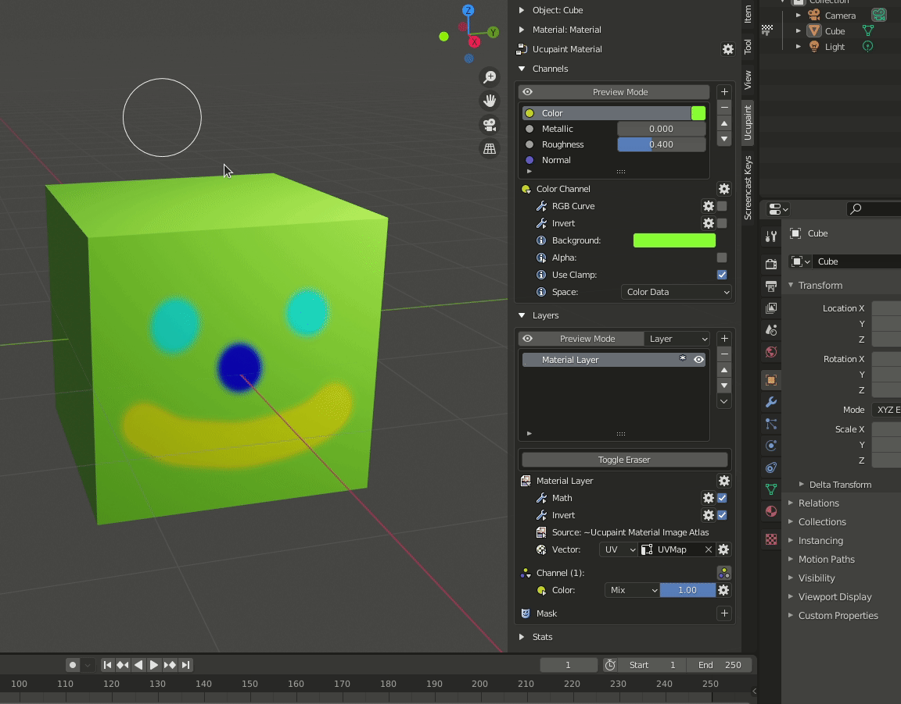
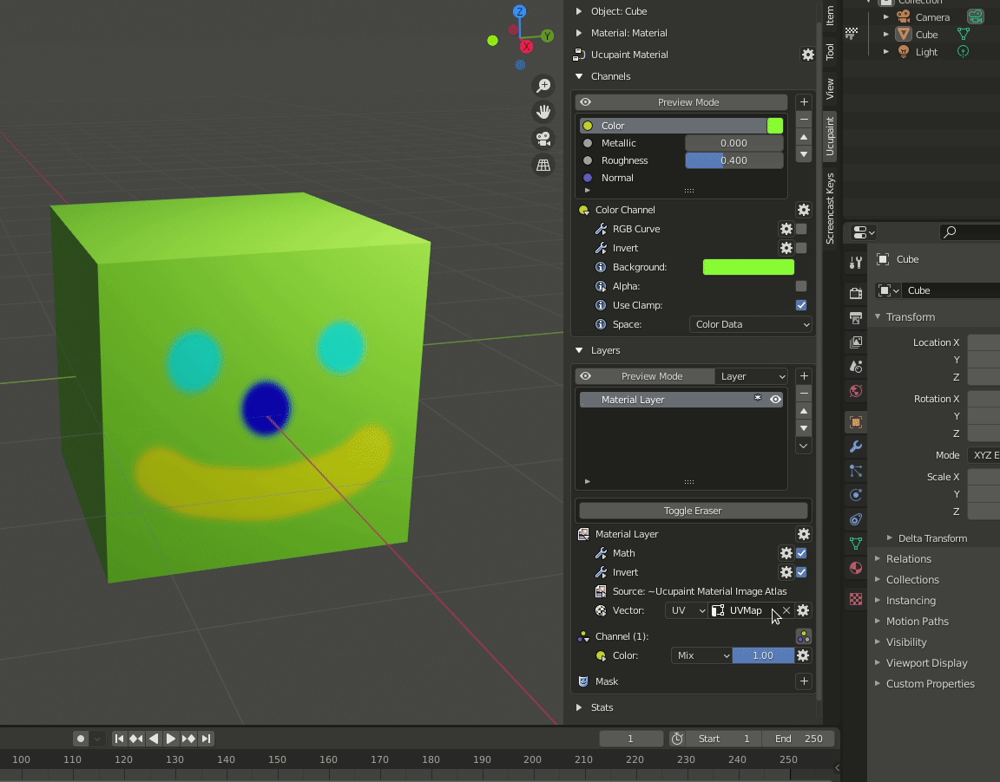
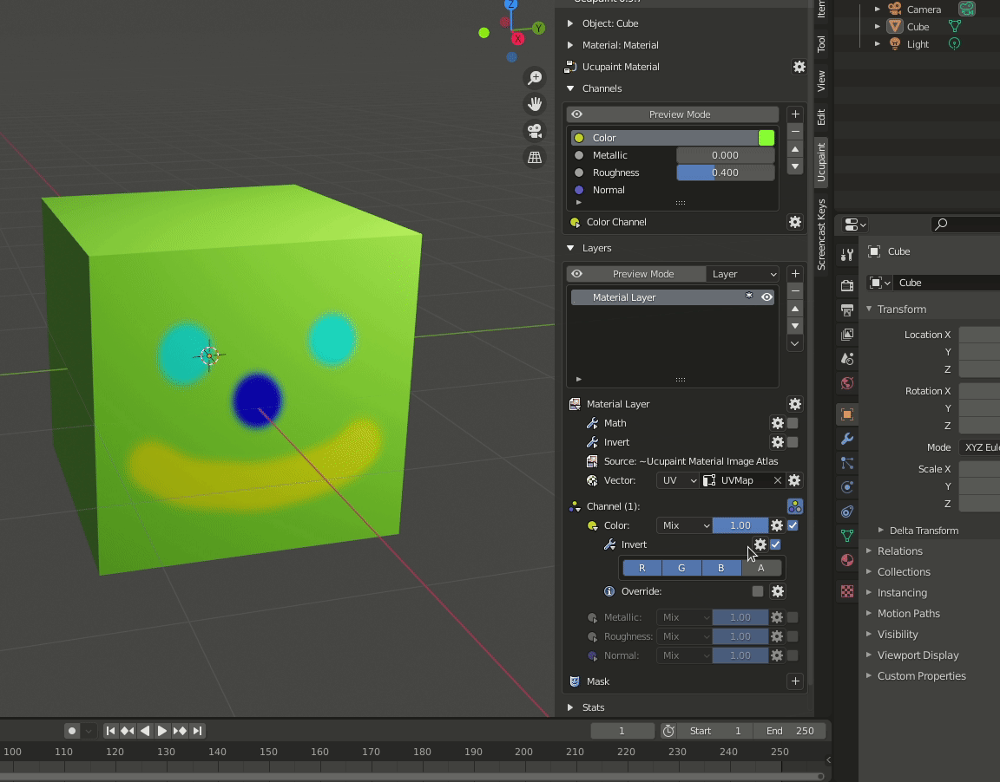
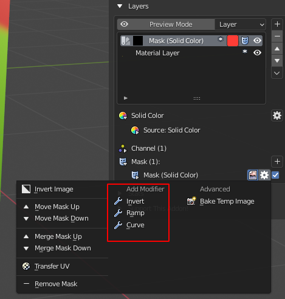
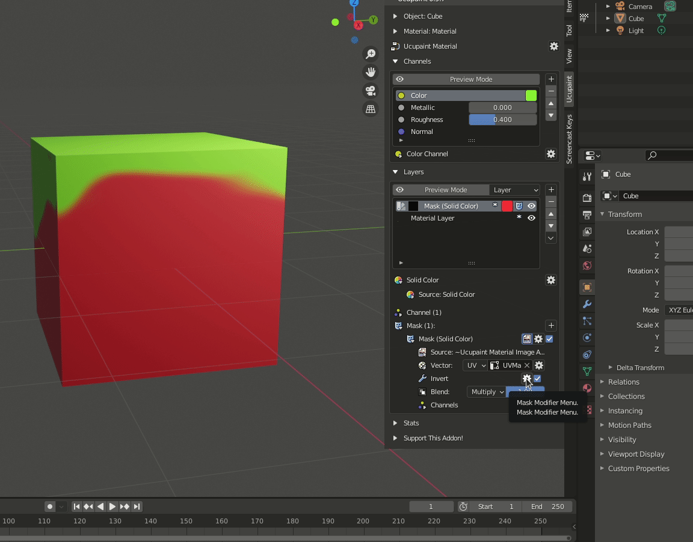

# Modifier Operation

## Channel Modifier

Channel Modifier bring the modifier effect in to output of selected channel.

Available modifier type :

- Invert
- RGB to Intensity
- Intensity to RGB
- Color Ramp
- RGB Curve
- Hue Saturation
- Brightness Contrast
- Math

read the detail of the modifier type in [Modifier Type]() section.

### Add

To add modifier to a channel we can just click the gear button near the Channel Properties and select the modifier.

### Remove

We can remove the modifier using the modifier menu (gear button near the modifier name) and click the remove modifier button.

### Move

To move the modifier, we can use the arrow button in the modifier menu.

### Hide/Show

For hide and show (enable / disable) the modifier, we can control it using check box in the side of modifier menu.

## Layer Modifier

Available modifier type :

- Invert
- RGB to Intensity
- Intensity to RGB
- Color Ramp
- RGB Curve
- Hue Saturation
- Brightness Contrast
- Math

read the detail of the modifier type in [Modifier Type]() section.

### Add

To add modifier to a layer we can just click the gear button near the Layer Properties and select the modifier.

### Remove

We can remove the modifier using the modifier menu (gear button near the modifier name) and click the remove modifier button.

### Move

To move the modifier, we can use the arrow button in the modifier menu.

### Hide/Show

For hide and show (enable / disable) the modifier, we can control it using check box in the side of modifier menu.

## Layer Channel Modifier

Available modifier type :

- Invert
- RGB to Intensity
- Intensity to RGB
- Color Ramp
- RGB Curve
- Hue Saturation
- Brightness Contrast
- Math

read the detail of the modifier type in [Modifier Type]() section.

### Add

To add modifier to a layer channel we can just click the gear button near the Layer Channel Properties and select the modifier.

### Remove

We can remove the modifier using the modifier menu (gear button near the modifier name) and click the remove modifier button.

### Move

To move the modifier, we can use the arrow button in the modifier menu.

### Hide/Show

For hide and show (enable / disable) the modifier, we can control it using check box in the side of modifier menu.

## Mask Modifier

Available modifier type :

- Invert
- Color Ramp
- Curve

read the detail of the modifier type in [Modifier Type]() section.

### Add

To add modifier to a mask we can just click the gear button near the mask Properties and select the modifier.

### Remove

We can remove the modifier using the modifier menu (gear button near the modifier name) and click the remove modifier button.

### Move

To move the modifier, we can use the arrow button in the modifier menu.

### Hide/Show

For hide and show (enable / disable) the modifier, we can control it using check box in the side of modifier menu.