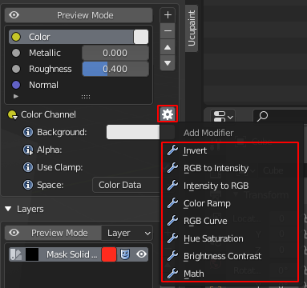
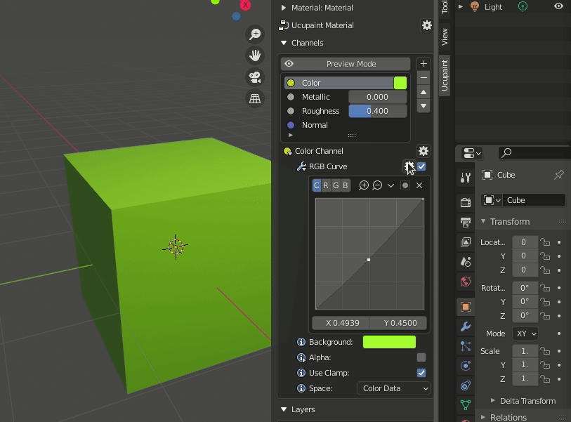

# Modifier Operation

## Channel Modifier

Available modifier type :

- Invert
- RGB to Intensity
- Intensity to RGB
- Color Ramp
- RGB Curve
- Hue Saturation
- Brightness Contrast
- Math

read the detail of the modifier type in [Modifier Type]() section.

### Add

To add modifier to the channel we can just click the gear button near the Channel Properties and select the modifier.

### Remove

We can remove the modifier using the modifier menu (gear button near the modifier name) and click the remove modifier button.

### Move

To move the modifier, we can use the arrow button in the modifier menu.

## Layer Modifier

### Add

### Remove

### Move

## Mask Modifier

### Add

### Remove

### Move