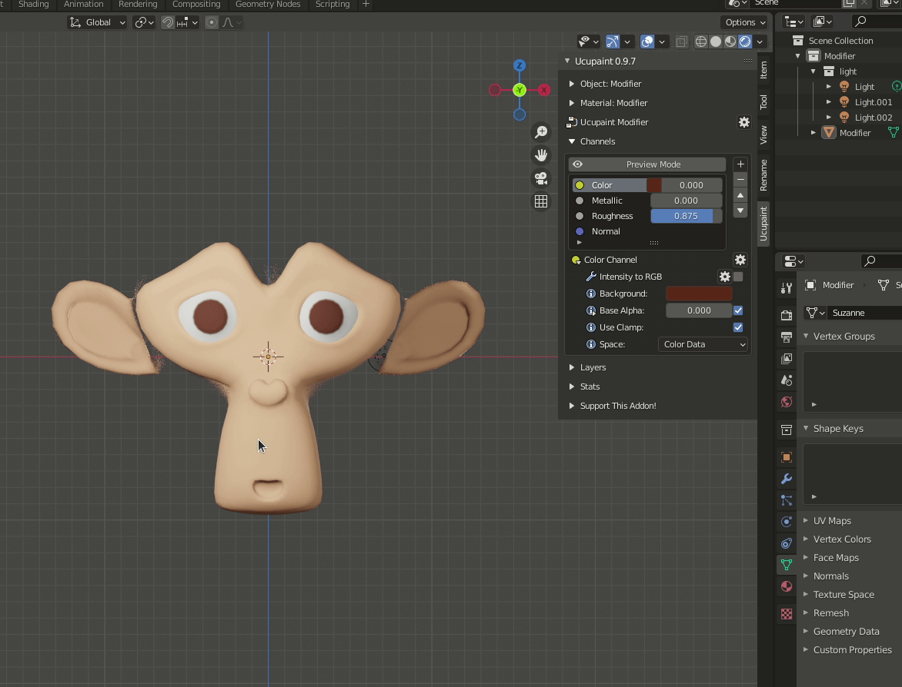

# Modifier

## Invert

We can invert an output value with this modifier. The different of UCUPAINT Invert Modifier and the original Invert node is that UCUPAINT Invert Modifier can control the R,G,B, and Alpha channel of an output value.

## RGB to intensity

Converting RGB value to intensity. The RGB value is used as alpha intensity and the color will be replaced by the color input on the modifier options.

## Intensity to RGB

Converting intensity to RGB.

## Color Ramp

Control value of selected layer with color ramp. this modifier is based on the blender [Color Ramp Node](https://docs.blender.org/manual/en/latest/modeling/geometry_nodes/color/color_ramp.html).  

## RGB Curve/Curve

Control RGB value of selected layer with Curve. this modifier is based on the blender [RGB Curve Node](https://docs.blender.org/manual/en/latest/render/shader_nodes/color/rgb_curves.html).

## Hue Saturation

Control hue saturation of the layer value. this modifier is based on the blender [Hue Saturation Node](https://docs.blender.org/manual/en/latest/render/shader_nodes/color/hue_saturation.html).

## Brightness Contrast

Control of selected layer brightness contrast. this modifier is based on the blender [Brightness/Contrast Node](https://docs.blender.org/manual/en/latest/render/shader_nodes/color/bright_contrast.html)

## Math

Add math operation to selected layer. this modifier is based on the blender [Math Node](https://docs.blender.org/manual/en/latest/render/shader_nodes/converter/math.html).

Not all math type is covered by this modifier for now. this is the list of available math type in UCUPAINT Math Modifier :

1. Add
2. Subtract
3. Multiply (Default)
4. Divide
5. Power
6. Logarithm