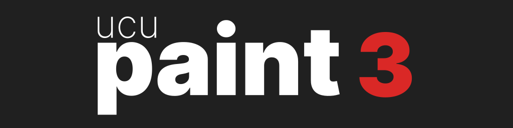

# Branding

### Logo

The Ucupaint Logo is designed to be simple and readable.  
It uses the same font as blender itself: **`Inter`**

The major version number (in this example `3`) is added to the typeface.

    <table>
    <thead>
            <tr><td>svg</td><td>img</td><td>img + background</td></tr>
    </thead>
    <tbody>
        <tr><td></td><td></td><td></td></tr>
    </tbody>
    </table>

### Icon

The Ucupaint icon is made for small scale use (within blender, favicons, discord UI, etc.)  
It's a recreation of the old Discord icon with a slightly modified `black` `Inter`.

    <table>
    <thead>
            <tr><td>svg</td><td>img</td></tr>
    </thead>
    <tbody>
        <tr><td></td><td></td></tr>
    </tbody>
    </table>

### Colours

    <table>
    <tbody>
        <tr><td>White</td><td>UcuRed</td><td>Dark Grey</td></tr>
        <tr><td>#FFFFFF</td><td>#DA2826</td><td>#181818</td></tr>
    </tbody>
    </table>

### License

The ucupaint branding was created by [Aaron Kerker](https://aaronkerker.de) and is licensed under the `Creative Commons CC BY 4.0` License ([https://creativecommons.org/licenses/by/4.0/](https://creativecommons.org/licenses/by/4.0/)).

