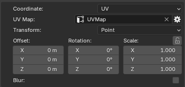
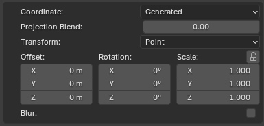
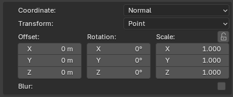
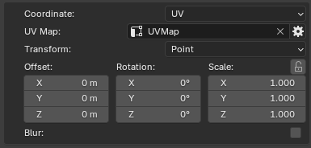
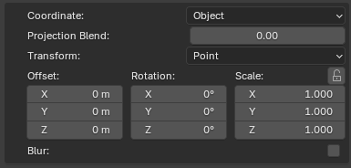
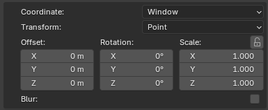
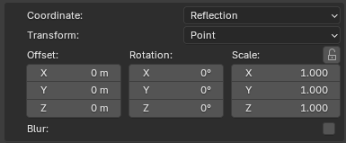
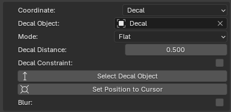
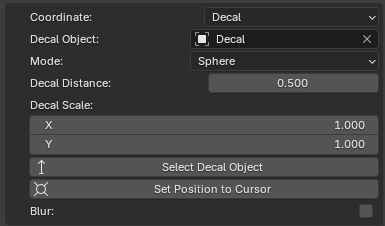
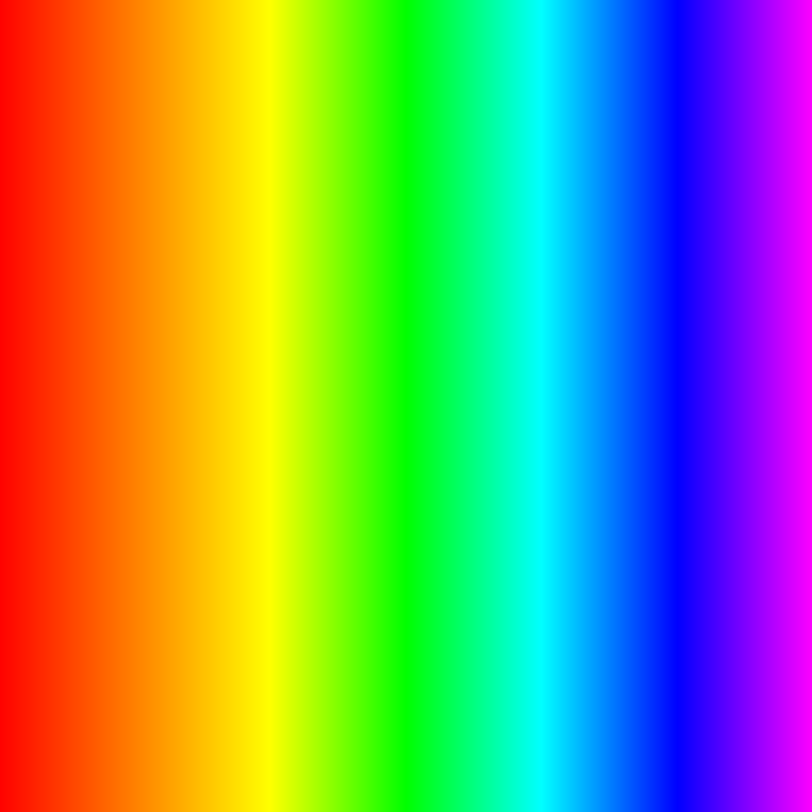

# Mapping

The layer mapping defines how layer is projected onto the mesh. Ucupaint provides several mapping methods, each using a different coordinate system to determine how the layer is applied to the surface. By default, layers use UV mapping.

## Mapping controls

Most mapping methods provide controls to adjust the mapping position and orientation, including offset, rotation, scale, and transform vector. Decal mapping is the only mapping method that does not provide these transform controls.

||
|:--:|
|Default Menu| {align=center}

The mapping panel includes the following configurable parameters

- Coordinate: Select the mapping method. See mapping methods bellow. 

- Transform: Specifies the transformation space or type.

- Offset: Shifts the position on the texture across axis.

- Rotation: Rotates the texture oriantation.

- Scale: Scales the Textrue along axis. 

- Blur: Applies a blur filter to mapping vector (Blender does not provide native blur).

Some methods provide additional options.

### Generated
Generated provides an additional option, Projection Blend, which mixes the the texture around the objects corners and edges.

||
|:--:|
|Generated Menu| {align=center}

### Normal
Does not provide any additional options.

||
|:--:|
|Normal Menu| {align=center}

### UV
The UV method takes in a UV Map, which dictates which UV coordinates to utilize for mapping without changing the object's original UV map.

||
|:--:|
|UV Menu| {align=center}

### Object
Object Similar to Generated, also poseses the blend option which mixes the textures around the corners and edges.

||
|:--:|
|Object Menu| {align=center}

### Camera, Window and Reflection 
Doesn't provide any additional options.

||
|:--:|
|Camera Menu| {align=center}

||
|:--:|
|Window Menu| {align=center}

||
|:--:|
|Reflection Menu| {align=center}

### Decal
The Decal method is an exception and does not provide Transform, Offset, Scale, or Rotate options. Instead, it possesses the following options:

- Decal Object: Points to object in scene to use as decal projection.\

- Mode: Choses from decal projections methods (Flat, Cylinder, Sphere)

- Decal Distance: Controls how far texture is projected.

- Select Decal Object: A button that automatically selects the decal object.

- Set Position to cursor: Sets the 3d space cursor to the decal position. 

Decals have few methods that allow diffrent ways of mapping the texture onto the object. Those methods also provide additional settings:

#### Flat (default)

- Decal constraint: applies constraints to surface modifier, pulling decal to be always on surface of the object.

||
|:--:|
|Flat Decal Menu| {align=center}

#### Cylinder and Sphere
- Scale: provide scaling for the image X and Y across the decal projection allowing for repetition or cropping of the decal projected part. 

||
|:--:|
|Cylinder Decal Menu| {align=center}

||
|:--:|
|Sphere Decal Menu| {align=center}

To ilustrate the mapping methods, The following examples use the same image to demonstrate how it is projected onto the mesh.

||
|:--:|
|Texture| {align=center}

## Generated

Generated mapping projects the layer around the mesh from all directions using coordinates generated from its geometry, creating a box-like projection around the object.

||
|:--:|
|Generated| {align=center}

## Normal

Normal mapping projects the layer onto the mesh using the direction of its surface normals, creating a projection that follows the orientation of the surface.

||
|:--:|
|Normal| {align=center}

## UV

UV mapping projects the layer onto the mesh using its UV coordinates, allowing the layer to follow the existing UV layout of the object.

||
|:--:|
|UV| {align=center}

## Object

Object mapping projects the layer using the mesh's coordinates in Blender's 3D space, creating a three-dimensional projection around the object.

||
|:--:|
|Object| {align=center}

## Camera

Camera mapping projects the layer onto the mesh from the camera's viewpoint, creating a projection that follows the camera's position and orientation.

||
|:--:|
|Camera| {align=center}

## Window

Window mapping projects the layer onto the mesh using screen-space coordinates, similar to cutting out a picture in the shape of the mesh from the background.

||
|:--:|
|Window| {align=center}

## Reflection

Reflection mapping projects the layer onto the mesh using reflection directions calculated from the camera and the surface normals, similar to reflecting a ray off a reflective surface to determine where the texture is sampled.

||
|:--:|
|Reflection| {align=center}

## Decal

Decal mapping projects the layer onto the mesh using a defined projection shape. The projection distance controls the region of the mesh affected by the decal.

Cylinder and sphere projections also provide tiling controls, allowing the texture to be cut to the projection shape or repeated around the mesh.

### Plane

Plane decal mapping projects the layer from a flat plane onto the mesh, similar to projecting an image straight onto a surface.

||
|:--:|
|Decal plane| {align=center}

### Cylinder

Cylinder decal mapping projects the layer from the inside of a cylinder onto the mesh, like placing the image on the inside of a tube and projecting it onto the object.

||
|:--:|
|Decal cylinder| {align=center}

### Sphere

Sphere decal mapping projects the layer from the inside of a sphere onto the mesh, like placing the image on the inside of a ball and projecting it onto the object.

||
|:--:|
|Decal sphere| {align=center}